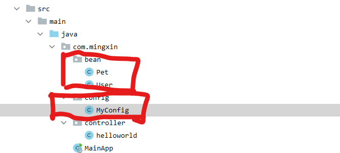

#### 1. Configuration 注解

>   SpringBoot基于注册注解的Bean构建

Spring 的 Bean 构建一般基于 `xml` 文件进行配置，但是这样做太麻烦，SpringBoot中基于`Configuration` 注解构建`Bean`。



```java
// configure文件
@Configuration
public class MyConfig {
    @Bean("user01") // 设置bean的名称
    @Scope("prototype") // 设置多实例模式
    public User user01() {
        return new User("zhangsan",11);
    }
}
```

#### 2.  ConfigurationProperties  配置绑定

用于设置一些类的默认参数，比如mysql的密码，链接地址等。比如我想要在 `application.properties` 中配置 `Pet` 类的默认名称。

首先配置 `Pet.java`

```java
@Component // 将Pet加入到Spring IOC容器中
@ConfigurationProperties(prefix = "mypet")
public class Pet {
    private String name;

    public String getName() {
        return name;
    }

    public void setName(String name) {
        this.name = name;
    }
}

```

接着配置，`Controll` 文件

```java
@Controller
@ResponseBody
public class helloworld {
    @Autowired
    private Pet pet;

    @RequestMapping("/pet01")
    public Pet pet01() {
        return pet;
    }
}

```

最后在配置文件中设置：

```xml
mypet.name=dahaung
```

