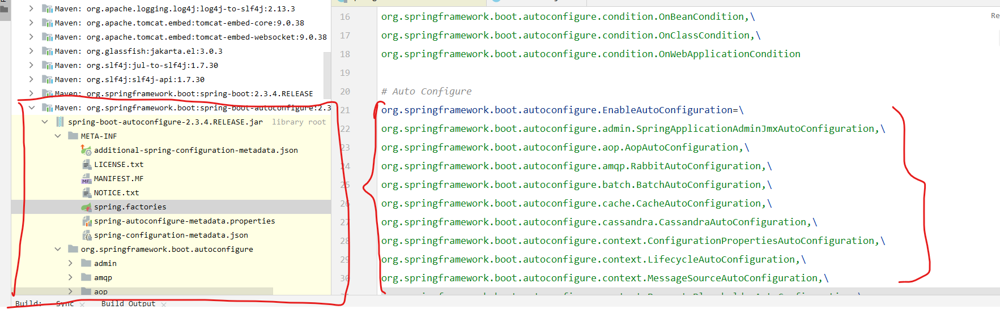

#### 1. SpringBootApplication基本内容

除了元注解之外，主要包含三个注解：

```java
@SpringBootConfiguration
@EnableAutoConfiguration
@ComponentScan(
    excludeFilters = {@Filter(
    type = FilterType.CUSTOM,
    classes = {TypeExcludeFilter.class}
), @Filter(
    type = FilterType.CUSTOM,
    classes = {AutoConfigurationExcludeFilter.class}
)}
)
public @interface SpringBootApplication {
}
```

#### 2. @SpringBootConfiguration 注解

`@Configuration` 表示当前是一个配置类


#### 3. @ComponentScan

指定扫描哪些类


#### 4. @EnableAutoConfiguration

>   `@EnableAutoConfiguration` 注解

```java
@AutoConfigurationPackage // <--- 1
@Import({AutoConfigurationImportSelector.class}) // <--- 2
public @interface EnableAutoConfiguration { 
}
```

>   1 - `@AutoConfigurationPackage` 注解

```java
@Import({Registrar.class})
public @interface AutoConfigurationPackage {
    String[] basePackages() default {};

    Class<?>[] basePackageClasses() default {};
}
```

>   1- `Registrar.class`

```java
static class Registrar implements ImportBeanDefinitionRegistrar, DeterminableImports {
        Registrar() {
        }

        public void registerBeanDefinitions(AnnotationMetadata metadata, BeanDefinitionRegistry registry) {
            // 批量导入
            AutoConfigurationPackages.register(registry, (String[])(new AutoConfigurationPackages.PackageImports(metadata)).getPackageNames().toArray(new String[0]));
        }

        public Set<Object> determineImports(AnnotationMetadata metadata) {
            return Collections.singleton(new AutoConfigurationPackages.PackageImports(metadata));
        }
    }
```

>   2 - `AutoConfigurationImportSelector.class`  

`AutoConfigurationImportSelector-->getCandidateConfigurations --> this.getSpringFactoriesLoaderFactoryClass()`

```java
protected List<String> getCandidateConfigurations(AnnotationMetadata metadata, AnnotationAttributes attributes) {
    List<String> configurations = SpringFactoriesLoader.loadFactoryNames(this.getSpringFactoriesLoaderFactoryClass(), this.getBeanClassLoader()); // this.getSpringFactoriesLoaderFactoryClass
    Assert.notEmpty(configurations, "No auto configuration classes found in META-INF/spring.factories. If you are using a custom packaging, make sure that file is correct.");
    return configurations;
}

```

接着可以得到：

```java
protected Class<?> getSpringFactoriesLoaderFactoryClass() {
    return EnableAutoConfiguration.class;
}
```

然后可以找到对应的文件：



#### 5. Bean的生命周期

.png)