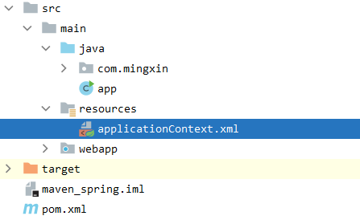
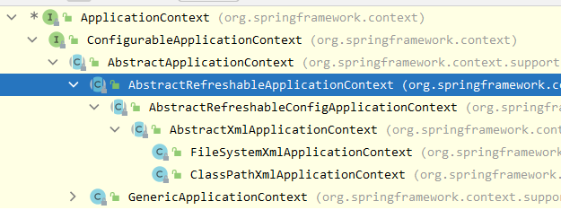
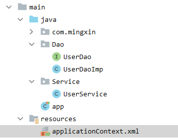
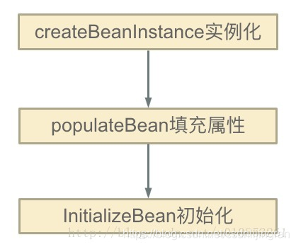
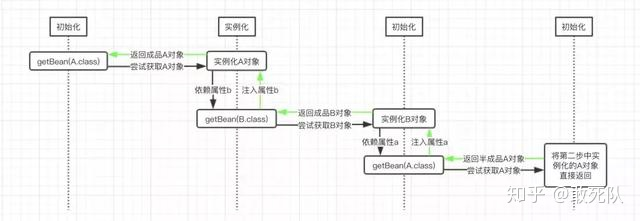
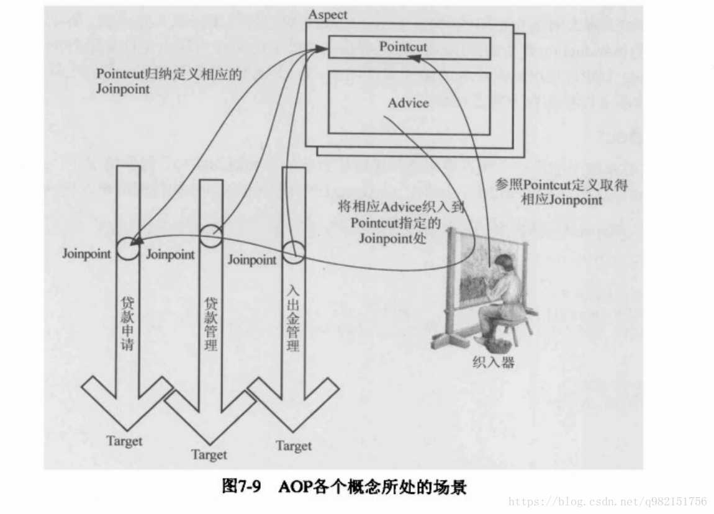

#### 概述

+   Spring 是一个轻量级、开源的、JavaEE框架

+   重点在于`IOC`和`AOP`
    +   IOC控制反转，把创建对象的过程交给Spring进行管理
    +   AOP面向切面，不修改源代码进行功能增强
+   优点
    +   方便解耦，简化开发。
    +   方便测试
    +   方便和其他框架整合


#### 一个简单例子

+   构建pom.xml文件

```xml
<!--springframework-->
<dependency>
    <groupId>org.springframework</groupId>
    <artifactId>spring-beans</artifactId>
    <version>5.2.5.RELEASE</version>
</dependency>
<dependency>
    <groupId>org.springframework</groupId>
    <artifactId>spring-core</artifactId>
    <version>5.2.5.RELEASE</version>
</dependency>
<dependency>
    <groupId>org.springframework</groupId>
    <artifactId>spring-context</artifactId>
    <version>5.2.5.RELEASE</version>
</dependency>
```

+   创建java文件夹和resource文件夹



+  创建Sping的xml配置文件 applicationContext.xml

```xml
<?xml version="1.0" encoding="UTF-8"?>
<beans xmlns="http://www.springframework.org/schema/beans"
       xmlns:xsi="http://www.w3.org/2001/XMLSchema-instance"
       xsi:schemaLocation="http://www.springframework.org/schema/beans http://www.springframework.org/schema/beans/spring-beans.xsd">
    <bean id="video" class="com.mingxin.Video">
        <property name="id" value="9"></property>
        <property name="title" value="Spring5.X课程"></property>
    </bean>
</beans>
```
+ 在Java文件夹下，创建对应的类对象

```java
package com.mingxin;

public class Video {
    private int id;
    private String title;

    public int getId() {
        return id;
    }

    public void setId(int id) {
        this.id = id;
    }

    public String getTitle() {
        return title;
    }

    public void setTitle(String title) {
        this.title = title;
    }
}
```

+ 创建一个测试

```java
public class app {
    @Test
    public void test() {
        ApplicationContext applicationContext = new ClassPathXmlApplicationContext("applicationContext.xml");
        Video video = (Video) applicationContext.getBean("video");
        System.out.println(video.getTitle());
    }
}

```


## 控制反转~IoC

#### 基本概述

+   将对象创建和对象之间的调用过程，交给Spring进行管理
+   使用IoC是为了降低耦合度

#### IoC底层原理

+   xml解析、工厂模式、反射机制

#### IoC过程

+   第一步：xml配置文件，配置创建对象

    ```xml
    <bean id="dao" class="com.data.UserDao">
    ```

+   第二步：创建工厂

    ```java
    class Facotry {
        public static UserDao getUserDao() { // 3 工厂模式
            String classValue = class属性值;// 1 xml解析
            Class clazz = Class.forName(classValue); // 2 反射机制
            UserDao obj = (UserDao) clazz.newInstance();
            return obj;
        }
    }
    ```


#### IoC 接口

+   **IoC思想基于IoC容器完成，IoC容器底层就是对象工厂**

+   Spring提供IoC容器的两种实现方式

    +   （1）Bean Factory
        +   是Spring内部使用的一个接口，一般不提供给开发人员使用
        +   加载配置文件不会创建对象，在获取对象才去创建对象。
    +   （2）ApplicationContext
        +   是BeanFactory是的一个子接口，提供了更多更强大的功能，一般面向开发人员使用
        +   加载配置文件时，就会在配置文件对象进行创建

+   ApplicationContext接口实现类

    

#### IoC 操作 Bean管理

+   Bean管理指的是两个操作
    +   Spring创建对象
    +   Spring注入属性
+    Bean管理操作
    +   **基于xml配置文件实现**
    +   **基于注解方式实现**


#### 基于xml创建对象

+   id属性，给对象起一个别名
+   class属性，类全路径（包类路径）
+   name属性，和id属性作用相同，而name中可以添加一些特殊字符
+   创建对象时候，默认执行的是无参的构造器

```xml
<bean id="video" class="com.mingxin.Video">
    <property name="id" value="9"></property>
    <property name="title" value="Spring5.X课程"></property>
</bean>
```

## Bean创建流程

```java
/**
1. Scan 扫描文件
2. Parse 对文件内容进行解析
    2.1 生成对应的BeanDefinition
    2.2 将scan中的内容赋值到BeanDefinition中
    2.3 将BeanDefinition存放到map中
    2.4 利用List将当前类名存储起来
3. 遍历Map，根据BeanDefinition中的内容确定是否创建
*/
```


#### 如何解决循环依赖问题


## XML注入

#### 基于xml注入属性

+   set方法注入

```java
// 定义java-bean
public class Video {
    private int id;
    private String title;

    public int getId() {
        return id;
    }

    public void setId(int id) {
        this.id = id;
    }

    public String getTitle() {
        return title;
    }

    public void setTitle(String title) {
        this.title = title;
    }
}

// 定义xml文件注入
<bean id="video" class="com.mingxin.Video">
    <property name="id" value="9"></property>
    <property name="title" value="Spring5.X课程"></property>
</bean>
```

+   有参构造器注入

```java
// 定义java-bean
public class Book {
    String name;
    Book(String name) {
        this.name = name;
    }

    public String getName() {
        return name;
    }
}

// 定义xml文件注入
<bean id="book" class="com.mingxin.Book">
    <constructor-arg name="name" value="Spring"></constructor-arg>
</bean>
```

#### xml注入字面量

+   null值

    ```java
    // 定义java-bean
    public class Video {
        private int id;
        private String title;
    
        public int getId() {
            return id;
        }
    
        public void setId(int id) {
            this.id = id;
        }
    
        public String getTitle() {
            return title;
        }
    
        public void setTitle(String title) {
            this.title = title;
        }
    }
    // 定义xml文件注入
        <bean id="book" class="com.mingxin.Book">
            <property name="name" value="Love"></property>
            <property name="price">
                <null/>
            </property>
        </bean>
    ```

+ 引入特殊字符

    ```xml
        <bean id="book" class="com.mingxin.Book">
            <property name="name" value="Love"></property>
            <property name="price">
                <value>
                    <![CDATA[
                    <<China>>
                    ]]>
                </value>
            </property>
        </bean>
    ```


#### 注入bean属性

>   **外部Bean**



首先定义，Dao接口和实现类：

```java
public interface UserDao {
    void update();
}
public class UserDaoImp implements UserDao{
    @Override
    public void update() {
        System.out.println("dao update");
    }
}
```

接着定义Service类

```java
public class UserService {
    private UserDao dao;

    public void setDao(UserDao dao) {
        this.dao = dao;
    }

    public void add() {
        System.out.println("service add");
        this.dao.update();
    }
}
```

最后定义xml进行外部bean注入，注意使用ref：

```xml
    <bean id="userService" class="Service.UserService">
        <property name="dao" ref="userDao"></property>
    </bean>
    <bean id="userDao" class="Dao.UserDaoImp"></bean>
```

>   **内部Bean**

上面的那种ref做法，也可以采用下面的这种方式，称为内部bean：

```xml
    <bean id="userService" class="Service.UserService">
        <property name="dao">
            <bean id="userDao" class="Dao.UserDaoImp"></bean>
        </property>
    </bean>
```

>   **级联Bean**

如果需要对xml进行赋值，则可以修改成如下方式，称为级联赋值

```xml
    <bean id="userService" class="Service.UserService">
        <property name="dao" ref="userDao"> </property>
        <!-- 注意可达性的问题，确认属性是否能够被访问到，不能为接口-->
        <property name="dao.url" value="google.com"></property>
    </bean>
    <bean id="userDao" class="Dao.UserDaoImp">
        <property name="url" value="baidu.com"></property>
    </bean>
```

#### xml注入集合类型属性

>   注入数组类型属性 & 注入List集合类型属性 & 注入Map数据类型

首先，定义java-bean类

```java

public class Stu {
    private String [] courses;
    private List<String> list;
    private Map<String,String> maps;
    private Set<String> sets;

    public void setCourses(String[] courses) {
        this.courses = courses;
    }

    public void setList(List<String> list) {
        this.list = list;
    }

    public void setMaps(Map<String, String> maps) {
        this.maps = maps;
    }

    public void setSets(Set<String> sets) {
        this.sets = sets;
    }

    public String[] getCourses() {
        return courses;
    }

    public List<String> getList() {
        return list;
    }

    public Map<String, String> getMaps() {
        return maps;
    }

    public Set<String> getSets() {
        return sets;
    }

    @Override
    public String toString() {
        return "Stu{" +
                "courses=" + Arrays.toString(courses) +
                ", list=" + list +
                ", maps=" + maps +
                ", sets=" + sets +
                '}';
    }
}
```

接着定义xml文件

```xml
 	<bean id="stu" class="day01.Stu">
        <property name="courses">
            <array>
                <value>Math</value>
                <value>Science</value>
            </array>
        </property>

        <property name="list">
            <list>
                <value>Tom</value>
                <value>Bob</value>
            </list>
        </property>

        <property name="maps">
            <map>
                <entry key="Tom" value="1001"></entry>
                <entry key="Bob" value="1002"></entry>
            </map>
        </property>

        <property name="sets">
            <set>
                <value>Tom</value>
                <value>Bob</value>
            </set>
        </property>
    </bean>
```

最后进行测试：

```java
    @Test
    public void test() {
        ApplicationContext applicationContext = new ClassPathXmlApplicationContext("applicationContext.xml");
        Stu stu = (Stu) applicationContext.getBean("stu");
        System.out.println(stu);
    }
```

#### xml注入对象列表

```xml
    <bean id="bookstore" class="day02.BookStore">
        <property name="books">
            <list>
                <ref bean="book1"></ref>
                <ref bean="book2"></ref>
            </list>
        </property>
    </bean>

    <bean id="book1" class="day02.Book">
        <property name="name" value="China"></property>
    </bean>
    <bean id="book2" class="day02.Book">
        <property name="name" value="China"></property>
    </bean>
```

#### xml引入命名空间

```xml
<?xml version="1.0" encoding="UTF-8"?>
<beans xmlns="http://www.springframework.org/schema/beans"
       xmlns:xsi="http://www.w3.org/2001/XMLSchema-instance"
       xmlns:util="http://www.springframework.org/schema/util"
       xsi:schemaLocation="http://www.springframework.org/schema/beans http://www.springframework.org/schema/beans/spring-beans.xsd
                            http://www.springframework.org/schema/util http://www.springframework.org/schema/util/spring-util.xsd">
        <util:list id="booklists">
            <value>China</value>
            <value>Japan</value>
            <value>Canada</value>
        </util:list>

    <bean id="bookstore" class="day02.BookStore">
        <property name="books" ref="booklists"></property>
    </bean>
</beans>
```

#### FactoryBean

>   定义对象和返回对象可以不一样，一般在getObject中定义

```java
public class MyBean implements FactoryBean<Book> {
    @Override
    public Book getObject() throws Exception {
        Book book = new Book();
        book.setName("China");
        return book;
    }

    @Override
    public Class<?> getObjectType() {
        return null;
    }
    
    @Override
    public String toString() {
        return super.toString();
    }
}
```

#### Bean作用域 单例或者多例

+   Spring中默认创建的对象是单例的
+   设置bean标签属性scope可以设置单例和多实例

```xml
<bean id="myBean" class="factorybean.MyBean" scope="singleton"></bean>
<bean id="myBean" class="factorybean.MyBean" scope="prototype"></bean>
```

+   singleton在加载配置文件时就会创建对象，prototype在调用getBean方法的时候才会创建对象
+   除此之外，还有两个参数request（一次请求）、session（一次会话）

#### Bean生命周期

生命周期就是从对象从创建到销毁的过程

+   通过构造器创建Bean的实例（调用构造器）

+   为Bean属性设置值和对其他Bean的引用（调用set方法）

    >   把bean实例传递给bean的前置处理器 postProcessBeforeInitialization

+   调用Bean的初始化方法（需要进行配置）

    >   把bean实例传递给bean的后置处理器 postProcessAfterInitialization

+   bean的使用（获取bean的对象）

+   当容器关闭时，对bean进行销毁

```java
// java bean 对象
public class Orders {
    private String oname;
    Orders() {
        System.out.println("1. create the order");
    }
    public void setOname(String oname) {
        System.out.println("2. set the value of the object");
        this.oname = oname;
    }

    public void initMethod() {
        System.out.println("3. execute the initMethod");
    }

    public void destoryMethod() {
        System.out.println("5. destory the bean");
    }
}

// xml配置文件
<?xml version="1.0" encoding="UTF-8"?>
<beans xmlns="http://www.springframework.org/schema/beans"
       xmlns:xsi="http://www.w3.org/2001/XMLSchema-instance"
       xmlns:util="http://www.springframework.org/schema/util"
       xsi:schemaLocation="http://www.springframework.org/schema/beans http://www.springframework.org/schema/beans/spring-beans.xsd
                            http://www.springframework.org/schema/util http://www.springframework.org/schema/util/spring-util.xsd">

    <bean id="order" class="bean.Orders" init-method="initMethod" destroy-method="destoryMethod">
        <property name="oname" value="Phone"></property>
    </bean>
</beans>
        
// 测试
    @Test
    public void test2() {
        ApplicationContext applicationContext = new ClassPathXmlApplicationContext("bean2.xml");
        Orders order  = (Orders) applicationContext.getBean("order");
        System.out.println("4. create the order object");
        ((ClassPathXmlApplicationContext)applicationContext).close();
    }
```

#### Bean循环依赖

`Spring对于循环依赖的解决不是无条件的`，Spring解决循环依赖的前提是：`是针对scope单例`并且`显式指明需要解决循环依赖的对象`，`而且要求该对象没有被代理过`。同时`Spring解决循环依赖也不是万能`，`以上三种情况只能解决两种`，`第一种在构造方法中相互依赖的情况Spring也无力回天`。

+   只针对单例的Bean。

+   一句话，Spring通过递归和三级缓存解决循环依赖的。

Spring单例对象的初始化其实可以分为三步：（`实例化`、`填充属性`、`初始化`）



`循环依赖发生在：第一步和第二步`。

>   三级缓存

+   singletonObjects 一级缓存
+   earlySingletonObjects 二级缓存（半成品）
+   singletonFactory.getObject 三级缓存 （解决代理问题）

Spring中一个完整对象分为：对象的实例化和对象属性的填充。

递归调用链条：

```java
getBean() --> doGetBean() --> createBean() --> doCreateBean() --> populateBean() --> getBean()
```




```java
作者：皮皮Q
链接：https://zhuanlan.zhihu.com/p/84267654
来源：知乎
著作权归作者所有。商业转载请联系作者获得授权，非商业转载请注明出处。

protected  T doGetBean(final String name, @Nullable final Class requiredType,
    @Nullable final Object[] args, boolean typeCheckOnly) throws BeansException {
  
  // 尝试通过bean名称获取目标bean对象，比如这里的A对象
  Object sharedInstance = getSingleton(beanName);
  // 我们这里的目标对象都是单例的
  if (mbd.isSingleton()) {
    
    // 这里就尝试创建目标对象，第二个参数传的就是一个ObjectFactory类型的对象，这里是使用Java8的lamada
    // 表达式书写的，只要上面的getSingleton()方法返回值为空，则会调用这里的getSingleton()方法来创建
    // 目标对象
    sharedInstance = getSingleton(beanName, () -> {
      try {
        // 尝试创建目标对象
        return createBean(beanName, mbd, args);
      } catch (BeansException ex) {
        throw ex;
      }
    });
  }
  return (T) bean;
}
```


#### Bean管理 外部属性文件

+   手动引入

```xml
    <bean id="dataSource" class="com.alibaba.druid.pool.DruidDataSource">
        <property name="driverClassName" value="com.mysql.jdbc.Driver"></property>
        <property name="url" value="jdbc:mysql://localhost:3306/users"></property>
        <property name="username" value="root"></property>
        <property name="password" value="123"></property>
    </bean>
```

+   引入外部属性文件

```xml
<!-- 引入context命名空间 -->
<?xml version="1.0" encoding="UTF-8"?>
<beans xmlns="http://www.springframework.org/schema/beans"
       xmlns:xsi="http://www.w3.org/2001/XMLSchema-instance"
       xmlns:util="http://www.springframework.org/schema/util"
       xmlns:context="http://www.springframework.org/schema/context"
       xsi:schemaLocation="http://www.springframework.org/schema/beans http://www.springframework.org/schema/beans/spring-beans.xsd
                            http://www.springframework.org/schema/util http://www.springframework.org/schema/util/spring-util.xsd
                            http://www.springframework.org/schema/context http://www.springframework.org/schema/context/spring-context.xsd">
a
    <context:property-placeholder location="jdbc.properties"></context:property-placeholder>
    <bean id="dataSource" class="com.alibaba.druid.pool.DruidDataSource">
        <property name="driverClassName" value="${prop.driverClass}"></property>
        <property name="url" value="${prop.url}"></property>
        <property name="username" value="${prop.username}"></property>
        <property name="password" value="${prop.password}"></property>
    </bean>
</beans>

<!-- jdbc.properties -->
prop.driverClass=com.mysql.jdbc.Driver
prop.url=jdbc:mysql://localhost:3306/w3cshool
prop.username=root
prop.password=123
```


## 注解注入

### 对象创建的注解

#### 什么是注解

+   注解是代码特殊标记、格式@注解名(属性名称=属性值,属性名称=属性值)

+   使用注解，注解作用在类上、方法上面、属性上面

+   使用注解是为了简化xml

+   Spring提供了如下注解对象创建

    +   @Component
    +   @Service
    +   @Controller
    +   @Respository

    

#### 一个简单例子

```xml
<?xml version="1.0" encoding="UTF-8"?>
<beans xmlns="http://www.springframework.org/schema/beans"
       xmlns:xsi="http://www.w3.org/2001/XMLSchema-instance"
       xmlns:context="http://www.springframework.org/schema/context"
       xsi:schemaLocation="http://www.springframework.org/schema/beans http://www.springframework.org/schema/beans/spring-beans.xsd
                            http://www.springframework.org/schema/context http://www.springframework.org/schema/context/spring-context.xsd">
    <context:component-scan base-package="anno,bean"></context:component-scan>
</beans>


@Service(value = "userService") // <bean id="userService" class=></bean>
public class UserService {
    public void add() {
        System.out.println("bean add");
    }
}

```

#### 扫描特定注解的类

```xml
<!-- 扫描特定的类 -->
<context:component-scan base-package="anno,bean" use-default-filters="false">
        <context:include-filter type="annotation" expression="org.springframework.stereotype.Service"/>
    </context:component-scan>

<!-- 不扫描特定的类 -->
<context:component-scan base-package="anno,bean" use-default-filters="false">
        <context:exclude-filter type="annotation" expression="org.springframework.stereotype.Service"/>
    </context:component-scan>
```


### 属性注入的注解

#### 提供的注解

+   @AutoWired 自动注入，根据属性类型
+   @Qualifier 根据属性的名称进行注入
+   @Resource 可以根据类型注入，也可以根据名称注入
+   @Value 注入普通类型属性

@Autowired//默认按type注入
@Qualifier("cusInfoService")//一般作为@Autowired()的修饰用
@Resource(name="cusInfoService")//默认按name注入，可以通过name和type属性进行选择性注入


#### 一个例子

```java
// 首先开启注解扫描
<context:component-scan base-package="anno,bean"></context:component-scan>

// AutoWired 注解
@Service(value = "userService") // <bean id="userService" class=></bean>
public class UserService {
    @Autowired
    private UserDao mydao;

    public UserDao getMydao() {
        return mydao;
    }

    public void add() {
        System.out.println("Bean add");
        this.mydao.add();
    }
}

// Qualifier 注解
@Service(value = "userService") // <bean id="userService" class=></bean>
public class UserService {
    @Autowired
    @Qualifier(value = "myDaos") // 要配合Autowired使用，注入id为myDaos的bean
    private UserDao mydao;

    public UserDao getMydao() {
        return mydao;
    }

    public void add() {
        System.out.println("Bean add");
        this.mydao.add();
    }
}

// Resource注解
@Resource(name="tiger") // 注入id为tiger的bean
private Tiger tiger;
@Resource(type=Monkey.class)
private Monkey monkey;

// 根据类型
@Resource
private UserDao mydao;

// 根据名称注入
@Resource(name="myDaos")
private UserDao mydao;

// 注入普通属性
@Value(value = "214")
private String url;
```

#### 纯注解开发

```java
// 定义一个SpringConfig类
@Configuration
@ComponentScan(basePackages = {"anno"})
public class SpringConfig {
}

// 然后测试
@Test
public void test5() {
    ApplicationContext applicationContext = new AnnotationConfigApplicationContext(SpringConfig.class);
    UserService p = (UserService) applicationContext.getBean("userService");
    p.add();
}
```


## AOP 切面编程

#### 基本概念

+   面向切面编程（方面），利用 AOP 可以对业务逻辑的各个部分进行隔离，从而使得 业务逻辑各部分之间的耦合度降低，提高程序的可重用性，同时提高了开发的效率。

+   通俗描述：**不通过修改源代码方式，在主干功能里面添加新功能**

+   最流行的 AOP 框架有两个：**分别为 Spring AOP 和 AspectJ。**

+   专业术语

+   

    |        名称         |                             说明                             |
    | :-----------------: | :----------------------------------------------------------: |
    | Joinpoint（连接点） | 指那些被拦截到的点，在 Spring 中，可以被动态代理拦截目标类的方法。 |
    | Pointcut（切入点）  |      指要对哪些 Joinpoint 进行拦截，即被拦截的连接点。       |
    |   Advice（通知）    |  指拦截到 Joinpoint 之后要做的事情，即对切入点增强的内容。   |
    |   Target（目标）    |                      指代理的目标对象。                      |
    |   Weaving（植入）   |        指把增强代码应用到目标上，生成代理对象的过程。        |
    |    Proxy（代理）    |                      指生成的代理对象。                      |
    |   Aspect（切面）    |                     切入点和通知的结合。                     |

#### JDK 动态代理

+   UserDao接口

```java
public interface CustomerDao {
    public void add(); // 添加
    public void update(); // 修改
    public void delete(); // 删除
    public void find(); // 查询
}
```

+   UserDaoImpls实现类

```java
public class CustomerDaoImpl implements CustomerDao {

    @Override
    public void add() {
        System.out.println("添加客户...");
    }

    @Override
    public void update() {
        System.out.println("修改客户...");
    }

    @Override
    public void delete() {
        System.out.println("删除客户...");
    }

    @Override
    public void find() {
        System.out.println("查找客户...");
    }
}
```

+   切面类

```java
public class MyAspect {
    public void myBefore() {
        System.out.println("方法执行之前");
    }

    public void myAfter() {
        System.out.println("方法执行之后");
    }
}
```

+   代理类

```java
package com.mengma.jdk;

import java.lang.reflect.InvocationHandler;
import java.lang.reflect.Method;
import java.lang.reflect.Proxy;

import com.mengma.dao.CustomerDao;
import com.mengma.dao.CustomerDaoImpl;

public class MyBeanFactory {

    public static CustomerDao getBean() {
        // 准备目标类
        final CustomerDao customerDao = new CustomerDaoImpl();
        // 创建切面类实例
        final MyAspect myAspect = new MyAspect();
        // 使用代理类，进行增强
        return (CustomerDao) Proxy.newProxyInstance(
                MyBeanFactory.class.getClassLoader(),
                new Class[] { CustomerDao.class }, new InvocationHandler() {
                    public Object invoke(Object proxy, Method method,
                            Object[] args) throws Throwable {
                        myAspect.myBefore(); // 前增强
                        Object obj = method.invoke(customerDao, args);
                        myAspect.myAfter(); // 后增强
                        return obj;
                    }
                });
    }
}
```


#### CGLIB 代理子类

+   创建代理类

```java
public class GoodsDao {
    public void add() {
        System.out.println("添加商品...");
    }

    public void update() {
        System.out.println("修改商品...");
    }

    public void delete() {
        System.out.println("删除商品...");
    }

    public void find() {
        System.out.println("修改商品...");
    }
}
```

+   创建代理类

    ```java
    
    import java.lang.reflect.Method;
    import org.springframework.cglib.proxy.Enhancer;
    import org.springframework.cglib.proxy.MethodInterceptor;
    import org.springframework.cglib.proxy.MethodProxy;
    import com.mengma.dao.GoodsDao;
    import com.mengma.jdk.MyAspect;
    
    public class MyBeanFactory {
        public static GoodsDao getBean() {
            // 准备目标类
            final GoodsDao goodsDao = new GoodsDao();
            // 创建切面类实例
            final MyAspect myAspect = new MyAspect();
            // 生成代理类，CGLIB在运行时，生成指定对象的子类，增强
            Enhancer enhancer = new Enhancer();
            // 确定需要增强的类
            enhancer.setSuperclass(goodsDao.getClass());
            // 添加回调函数
            enhancer.setCallback(new MethodInterceptor() {
                // intercept 相当于 jdk invoke，前三个参数与 jdk invoke—致
                @Override
                public Object intercept(Object proxy, Method method, Object[] args,
                        MethodProxy methodProxy) throws Throwable {
                    myAspect.myBefore(); // 前增强
                    Object obj = method.invoke(goodsDao, args); // 目标方法执行
                    myAspect.myAfter(); // 后增强
                    return obj;
                }
            });
            // 创建代理类
            GoodsDao goodsDaoProxy = (GoodsDao) enhancer.create();
            return goodsDaoProxy;
        }
    }
    ```

+   通知 Advice ~ 增强的内容

| 名称                                                        | 说明                                                         |
| ----------------------------------------------------------- | ------------------------------------------------------------ |
| org.springframework.aop.MethodBeforeAdvice（前置通知）      | 在方法之前自动执行的通知称为前置通知，可以应用于权限管理等功能。 |
| org.springframework.aop.AfterReturningAdvice（后置通知）    | 在方法之后自动执行的通知称为后置通知，可以应用于关闭流、上传文件、删除临时文件等功能。 |
| org.aopalliance.intercept.MethodInterceptor（环绕通知）     | 在方法前后自动执行的通知称为环绕通知，可以应用于日志、事务管理等功能。 |
| org.springframework.aop.ThrowsAdvice（异常通知）            | 在方法抛出异常时自动执行的通知称为异常通知，可以应用于处理异常记录日志等功能。 |
| org.springframework.aop.IntroductionInterceptor（引介通知） | 在目标类中添加一些新的方法和属性，可以应用于修改旧版本程序（增强类）。 |

#### Spring通知类型及使用ProxyFactoryBean创建AOP代理

+    创建切面类 MyAspect, advice

```java
import org.aopalliance.intercept.MethodInterceptor;
import org.aopalliance.intercept.MethodInvocation;

//需要实现接口，确定哪个通知，及告诉Spring应该执行哪个方法
public class MyAspect implements MethodInterceptor {
    public Object invoke(MethodInvocation mi) throws Throwable {
        System.out.println("方法执行之前");
        // 执行目标方法
        Object obj = mi.proceed();
        System.out.println("方法执行之后");
        return obj;
    }
}
```

+   创建 Spring 配置文件

    ```xml
    <?xml version="1.0" encoding="UTF-8"?>
    <beans xmlns="http://www.springframework.org/schema/beans"
        xmlns:xsi="http:/www.w3.org/2001/XMLSchema-instance"
        xsi:schemaLocation="http://www.springframework.org/schema/beans
        http://www.springframework.org/schema/beans/spring-beans.xsd">
        <!--目标类 -->
        <bean id="customDao" class="proxy.CustomerDaoImpl"/>
        <!-- 通知 advice -->
        <bean id="myAspect" class="aop.MyAspect"/>
        <!--生成代理对象 -->
        <bean id="customDaoProxy" class="org.springframework.aop.framework.ProxyFactoryBean">
            <property name="proxyInterfaces" value="proxy.CustomerDao" />
            <!--代理的目标对象 object -->
            <property name="target" ref="customDao"/>
            <!--代理的name String -->
            <property name="interceptorNames" value="myAspect"/>
            <!-- 如何生成代理，true:使用cglib; false :使用jdk动态代理 -->
            <property name="proxyTargetClass" value="true"/>
        </bean>
    
    </beans>
    ```

    +   测试

    ```java
        @Test
        public void test8() {
            ApplicationContext applicationContext = new ClassPathXmlApplicationContext("applicationContext.xml");
            CustomerDao p =  applicationContext.getBean("customDaoProxy", CustomerDao.class);
            p.add();
        }
    ```

    

#### Spring使用AspectJ开发AOP：基于XML和基于Annotation

+   基于Annotation

```java
// 1. 切面类，增强，advice
// 通过 JoinPoint 参数可以获得目标对象的类名、目标方法名和目标方法参数等
@Aspect
@Component
public class MyAspect {
    @Pointcut("execution(*  AspectJAnno.CustomerDao.add(..))")
    private void myPointCut() {
    }

    // 前置通知
    @Before(value = "myPointCut()")
    public void myBefore(JoinPoint joinPoint) {
        System.out.print("前置通知，目标：");
        System.out.print(joinPoint.getTarget() + "方法名称:");
        System.out.println(joinPoint.getSignature().getName());
    }

    // 后置通知
    @AfterReturning(value = "myPointCut()")
    public void myAfterReturning(JoinPoint joinPoint) {
        System.out.println("后置通知，方法名称：" + joinPoint.getSignature().getName());
    }

    // 环绕通知
    @Around(value = "myPointCut()")
    public Object myAround(ProceedingJoinPoint proceedingJoinPoint)
            throws Throwable {
        System.out.println("==>环绕开始"); // 开始
        Object obj = proceedingJoinPoint.proceed(); // 执行当前目标方法
        System.out.println("==>环绕结束"); // 结束
        return obj;
    }

    // 异常通知
    @AfterThrowing(value = "myPointCut()",throwing ="e")
    public void myAfterThrowing(JoinPoint joinPoint, Throwable e) {
        System.out.println("异常通知" + "出错了" + e.getMessage());
    }

    // 最终通知
    @After(value = "myPointCut()")
    public void myAfter() {
        System.out.println("最终通知");
    }
}

// 2. 被增强类，被代理类 （采用Java动态代理接口的方式）
@Repository(value = "customerDao")
public class CustomerDaoImpl implements CustomerDao {
    @Override
    public void add() {
        System.out.println("method：添加客户...");
//        int data = 1/0;
    }

    @Override
    public void update() {
        System.out.println("修改客户...");
    }

    @Override
    public void delete() {
        System.out.println("删除客户...");
    }

    @Override
    public void find() {
        System.out.println("查找客户...");
    }
}

// 3. xml设置扫描参数
<?xml version="1.0" encoding="UTF-8"?>
<beans xmlns="http://www.springframework.org/schema/beans"
       xmlns:xsi="http://www.w3.org/2001/XMLSchema-instance"
       xmlns:aop="http://www.springframework.org/schema/aop"
       xmlns:context="http://www.springframework.org/schema/context"
       xsi:schemaLocation="http://www.springframework.org/schema/beans http://www.springframework.org/schema/beans/spring-beans.xsd
http://www.springframework.org/schema/aop http://www.springframework.org/schema/aop/spring-aop-2.5.xsd
http://www.springframework.org/schema/context http://www.springframework.org/schema/context/spring-context-2.5.xsd">

    <context:component-scan base-package="AspectJAnno"/>
    <aop:aspectj-autoproxy></aop:aspectj-autoproxy>

</beans>
        
// 4. 进行测试
    @Test
    public void test9() {
        ApplicationContext applicationContext = new ClassPathXmlApplicationContext("applicationContext2.xml");
        CustomerDao p = (CustomerDao) applicationContext.getBean("customerDao");
        p.add();
    }
```

+   基于xml配置

```java
// 1. 切面类
// 通过 JoinPoint 参数可以获得目标对象的类名、目标方法名和目标方法参数等
public class MyAspect {
    // 前置通知
    public void myBefore(JoinPoint joinPoint) {
        System.out.print("前置通知，目标：");
        System.out.print(joinPoint.getTarget() + "方法名称:");
        System.out.println(joinPoint.getSignature().getName());
    }

    // 后置通知
    public void myAfterReturning(JoinPoint joinPoint) {
        System.out.print("后置通知，方法名称：" + joinPoint.getSignature().getName());
    }

    // 环绕通知
    public Object myAround(ProceedingJoinPoint proceedingJoinPoint)
            throws Throwable {
        System.out.println("环绕开始"); // 开始
        Object obj = proceedingJoinPoint.proceed(); // 执行当前目标方法
        System.out.println("环绕结束"); // 结束
        return obj;
    }

    // 异常通知
    public void myAfterThrowing(JoinPoint joinPoint, Throwable e) {
        System.out.println("异常通知" + "出错了" + e.getMessage());
    }

    // 最终通知
    public void myAfter() {
        System.out.println("最终通知");
    }

}


// 2. 被代理类
public class CustomerDaoImpl implements CustomerDao {
    @Override
    public void add() {
        System.out.println("method：添加客户...");
//        int data = 1/0;
    }
    @Override
    public void update() {
        System.out.println("修改客户...");
    }
    @Override
    public void delete() {
        System.out.println("删除客户...");
    }
    @Override
    public void find() {
        System.out.println("查找客户...");
    }
}

// 3.xml文件
<?xml version="1.0" encoding="UTF-8"?>
<beans xmlns="http://www.springframework.org/schema/beans"
       xmlns:xsi="http://www.w3.org/2001/XMLSchema-instance"
       xmlns:aop="http://www.springframework.org/schema/aop"
       xsi:schemaLocation="http://www.springframework.org/schema/beans http://www.springframework.org/schema/beans/spring-beans.xsd
http://www.springframework.org/schema/aop http://www.springframework.org/schema/aop/spring-aop-2.5.xsd">

    <!--目标类 -->
    <bean id="customerDao" class="AspectJXML.CustomerDaoImpl" />
    <!--切面类 -->
    <bean id="myAspect" class="AspectJXML.MyAspect"/>

    <aop:config>
        <aop:aspect ref="myAspect">
            <aop:pointcut id="myPointCut" expression="execution (* AspectJXML.CustomerDaoImpl..*(..))"/>
            <aop:before method="myBefore" pointcut-ref="myPointCut"/>
            <aop:after method="myAfter" pointcut-ref="myPointCut"/>
            <aop:around method="myAround" pointcut-ref="myPointCut"/>
            <aop:after-returning method="myAfterReturning" pointcut-ref="myPointCut"/>
            <aop:after-throwing method="myAfterThrowing" pointcut-ref="myPointCut" throwing="e"/>
        </aop:aspect>
    </aop:config>
</beans>
        
// 4. 测试类
    @Test
    public void test8() {
        ApplicationContext applicationContext = new ClassPathXmlApplicationContext("applicationContext.xml");
        CustomerDao p =  applicationContext.getBean("customerDao", CustomerDao.class);
        p.add();
    }
```


#### Spring 循环依赖


