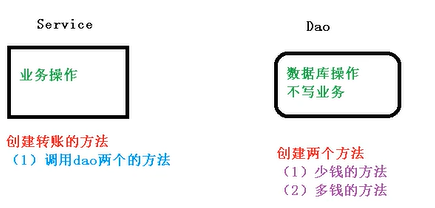
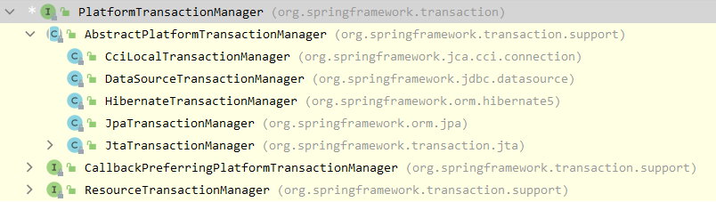
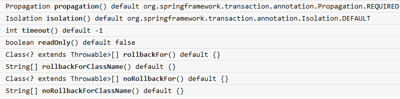
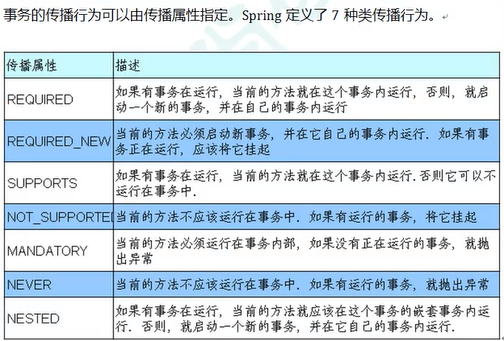

#### JdbcTemplate 基本的流程

+   xml中配置，自动扫描Service
+   Service中注入Dao
+   Dao中注入JdbcTemplate
+   JdbcTemplate执行sql语句

#### 基本例子

+   xml配置

```xml
<?xml version="1.0" encoding="UTF-8"?>
<beans xmlns="http://www.springframework.org/schema/beans"
       xmlns:xsi="http://ww w.w3.org/2001/XMLSchema-instance"
       xmlns:context="http://www.springframework.org/schema/context"
       xsi:schemaLocation="
       http://www.springframework.org/schema/beans http://www.springframework.org/schema/beans/spring-beans.xsd
       http://www.springframework.org/schema/context  http://www.springframework.org/schema/context/spring-context.xsd">

    <!-- 开启扫描 -->
    <context:component-scan base-package="jdbcT"/> 
    <!-- 外部属性文件 -->
    <context:property-placeholder location="jdbc.properties"/>
    <bean id="dataSource" class="org.springframework.jdbc.datasource.DriverManagerDataSource">
        <property name="driverClassName" value="${prop.driverClass}"/>
        <property name="url" value="${prop.url}"/>
        <property name="username" value="${prop.username}"/>
        <property name="password" value="${prop.password}"/>
    </bean>

    <bean id="jdbcTemplate" class="org.springframework.jdbc.core.JdbcTemplate">
        <property name="dataSource" ref="dataSource"/>
    </bean>
</beans>

// jdbc.properties
prop.driverClass=com.mysql.jdbc.Driver
prop.url=jdbc:mysql://localhost:3306/w3cshool
prop.username=root
prop.password=123
```

+   Service中注入Dao

```java
@Service(value = "userService")
public class UserService {
    @Autowired
    private UserDao myDao;

    public void addUser(User user) {
        myDao.add(user);
    }
}
```

+   Dao中注入JdbcTemplate

```java
@Repository
public class UserDao {
    @Autowired
    @Qualifier(value = "jdbcTemplate") // 要配合Autowired使用
    private JdbcTemplate jdbcTemplate;
    
    public void add(User user) {
        String excuteSql = "insert into users(u_id,father,country) values(?,?,?)";
        int update = jdbcTemplate.update(excuteSql, user.getU_id(), user.getFather(), user.getCountry());
        System.out.println(update);
    }
}
```

#### 事务操作

+   以银行转账为例



+   一个Sql事务

```mysql
DROP PROCEDURE IF EXISTS my_func;
DELIMITER $$
CREATE PROCEDURE my_func(in id int,in u_money FLOAT,inout sign int)
BEGIN
	declare c_money FLOAT DEFAULT 0;
	SELECT money INTO c_money from accountant where accountant.id=id;
	IF c_money >= u_money THEN SET sign=1;
	ELSE SET sign = 0;
	END IF;
END $$

set @sign=1;$$
CALL my_func(1,12,@sign);$$
SELECT @sign; $$
```

+   事务的操作过程

    +   开启事务的操作
    +   进行业务的操作
    +   异常的捕获以及回滚

+   **事务操作**

    +   1 Service一般添加到Service层

    +   2 Spring进行事务管理操作

        +   编程式事务管理 ×
        +   声明式事务管理 √

    +   3 声明式事务管理

        +   注解式
        +   xml式

    +   4 声明式事务管理，底层使用AOP原理

    +   5 相关API

        +   提供了一个接口，代表事务管理器，这个接口针对不同框架（Mybaits或者Hibernate）提供不同的实现类

            

        

#### 注解事务管理具体实现

+   创建事务管理器

    ```xml
        <!--- Transaction Manager -->
        <bean id="transactionManager"
              class="org.springframework.jdbc.datasource.DataSourceTransactionManager">
            <!-- 注入数据源 -->
            <property name="dataSource" ref="dataSource" />
        </bean>
    ```

+   在Spring配置文件，开始事务注解

```xml
<!-- 引入tx命名空间 -->
<?xml version="1.0" encoding="UTF-8"?>
<beans xmlns="http://www.springframework.org/schema/beans"
       xmlns:xsi="http://www.w3.org/2001/XMLSchema-instance"
       xmlns:context="http://www.springframework.org/schema/context"
       xmlns:tx="http://www.springframework.org/schema/tx"
       xmlns:aop="http://www.springframework.org/schema/aop"
       xsi:schemaLocation="http://www.springframework.org/schema/beans
            http://www.springframework.org/schema/beans/spring-beans-2.5.xsd
            http://www.springframework.org/schema/context
            http://www.springframework.org/schema/context/spring-context.xsd
            http://www.springframework.org/schema/tx
            http://www.springframework.org/schema/tx/spring-tx-2.5.xsd
            http://www.springframework.org/schema/aop
            http://www.springframework.org/schema/aop/spring-aop-2.5.xsd">
    
<!-- 开启事务注解 -->
    <tx:annotation-driven transaction-manager="transactionManager"/>
   
```

+   在Service类上或者方法上加上注解

```java
@Service(value = "userService")
@Transactional
public class UserService {
    @Autowired
    private UserDao myDao;

    public void addUser(User user) {
        myDao.add(user);
    }
}

```

+   完整xml

```xml
<?xml version="1.0" encoding="UTF-8"?>
<beans xmlns="http://www.springframework.org/schema/beans"
       xmlns:xsi="http://www.w3.org/2001/XMLSchema-instance"
       xmlns:context="http://www.springframework.org/schema/context"
       xmlns:tx="http://www.springframework.org/schema/tx"
       xmlns:aop="http://www.springframework.org/schema/aop"
       xsi:schemaLocation="http://www.springframework.org/schema/beans
            http://www.springframework.org/schema/beans/spring-beans-2.5.xsd
            http://www.springframework.org/schema/context
            http://www.springframework.org/schema/context/spring-context.xsd
            http://www.springframework.org/schema/tx
            http://www.springframework.org/schema/tx/spring-tx-2.5.xsd
            http://www.springframework.org/schema/aop
            http://www.springframework.org/schema/aop/spring-aop-2.5.xsd">

    <context:component-scan base-package="bank"/>
    <context:property-placeholder location="jdbc.properties"/>
    <bean id="dataSource" class="org.springframework.jdbc.datasource.DriverManagerDataSource">
        <property name="driverClassName" value="${prop.driverClass}"/>
        <property name="url" value="${prop.url}"/>
        <property name="username" value="${prop.username}"/>
        <property name="password" value="${prop.password}"/>
    </bean>

    <bean id="jdbcTemplate" class="org.springframework.jdbc.core.JdbcTemplate">
        <property name="dataSource" ref="dataSource"/>
    </bean>

    <!--- Transaction Manager -->
    <bean id="transactionManager"
          class="org.springframework.jdbc.datasource.DataSourceTransactionManager">
        <property name="dataSource" ref="dataSource" />
    </bean>

    <!-- 开启事务注解 -->
    <tx:annotation-driven transaction-manager="transactionManager"/>
</beans>
```

#### 注解事务管理参数设置



+   Propagation 事务传播行为

    +   就是一个方法调用另一个方法，事务如何处理
    +   Spring中一共定义了7中传播行为

    

+   isolation 隔离级别

    

+   timeout 超时时间

    事务要在一定的时间内进行操作，否者进行回滚

+   readonly 只读

    +   读数据，就是查询操作
    +   写数据，就是添加删除修改操作
    +   默认为false

+   rollbackFor 回滚

    +   可以设置出现哪些异常可以进行回滚

+   norollnackFor 不回滚

    +   可以设置出现哪些异常可以进行回滚，比如`noRollbackFor = {ArithmeticException.class}`

#### xml 事务管理的参数设置

+   首先配置事务管理器

```xml
    <!--- Transaction Manager -->
    <bean id="transactionManager"
          class="org.springframework.jdbc.datasource.DataSourceTransactionManager">
        <property name="dataSource" ref="dataSource" />
    </bean>

```

+   配置通知

```xml
    <tx:advice id="txAdvice" transaction-manager="transactionManager">
        <tx:attributes>
            <!-- 给切入点方法添加事务详情，name表示方法名称 -->
            <tx:method name="*" propagation="REQUIRED" isolation="DEFAULT"/>
        </tx:attributes>
    </tx:advice>
```

+   配置切入点和切面

```xml
    <!-- aop编写，让Spring自动对目标生成代理，需要使用AspectJ的表达式 -->
    <aop:config>
        <!-- 切入点 -->
        <aop:pointcut expression="execution(* bank.AccountService.*(..))" id="txPointCut" />
        <!-- 切面：将切入点与通知整合 -->
        <aop:advisor pointcut-ref="txPointCut" advice-ref="txAdvice" />
    </aop:config>
```


#### 全注解开发

+   定义一个注解类

```java
package config;

import org.springframework.context.annotation.Bean;
import org.springframework.context.annotation.ComponentScan;
import org.springframework.context.annotation.Configuration;
import org.springframework.jdbc.core.JdbcTemplate;
import org.springframework.jdbc.datasource.DataSourceTransactionManager;
import org.springframework.jdbc.datasource.DataSourceUtils;
import org.springframework.jdbc.datasource.DriverManagerDataSource;
import org.springframework.transaction.annotation.EnableTransactionManagement;

import javax.activation.DataSource;
import java.io.FileInputStream;
import java.io.FileNotFoundException;
import java.io.IOException;
import java.io.InputStream;
import java.util.Properties;

@Configuration
@ComponentScan(basePackages = "bank")
@EnableTransactionManagement
public class TxConfig {
    // 创建DataSource
    @Bean
    public DriverManagerDataSource getDataSource() {
        try {
            Properties prop = new Properties();
            InputStream resourceAsStream = TxConfig.class.getClassLoader().getResourceAsStream("jdbc.properties");
            prop.load(resourceAsStream);
            String driverClass = prop.getProperty("prop.driverClass");
            String url = prop.getProperty("prop.url");
            String username = prop.getProperty("prop.username");
            String password = prop.getProperty("prop.password");
            DriverManagerDataSource driverManagerDataSource = new DriverManagerDataSource();
            driverManagerDataSource.setDriverClassName(driverClass);
            driverManagerDataSource.setUrl(url);
            driverManagerDataSource.setUsername(username);
            driverManagerDataSource.setPassword(password);
            return driverManagerDataSource;
        } catch (FileNotFoundException e) {
            e.printStackTrace();
        } catch (IOException e) {
            e.printStackTrace();
        }
        return null;
    }

    // 创建JDBCTemplate对象
    @Bean
    public JdbcTemplate getJdbcTemplate(DriverManagerDataSource dataSource) {
        JdbcTemplate jdbcTemplate = new JdbcTemplate();
        jdbcTemplate.setDataSource(dataSource);
        return jdbcTemplate;
    }

    // 创建事务管理器
    @Bean
    public DataSourceTransactionManager getTransactionManager(DriverManagerDataSource dataSource) {
        DataSourceTransactionManager transactionManager = new DataSourceTransactionManager();
        transactionManager.setDataSource(dataSource);
        return transactionManager;
    }
}

```

+   在Service类上添加注解

```java
@Transactional
public class AccountService {
}
```

+   测试

```java
@Test
    public void test11() {
        ApplicationContext applicationContext = new AnnotationConfigApplicationContext(TxConfig.class);
        AccountService p =  applicationContext.getBean("accountService", AccountService.class);
        p.transfer("1002","1001",4);
    }
```

