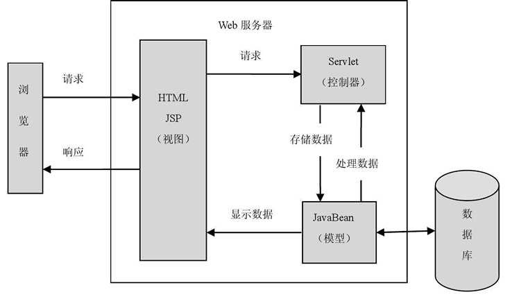
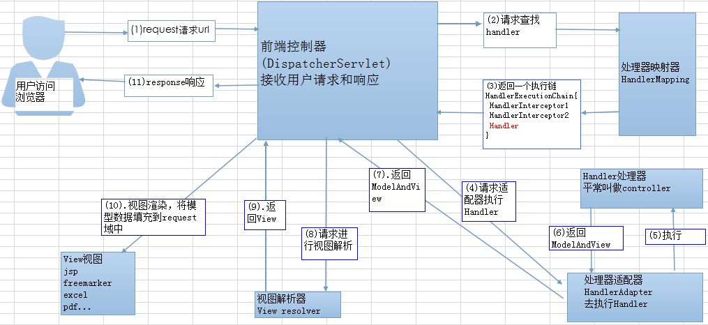

#### MVC 设计模式

MVC 是 Model、View 和 Controller 的缩写，分别代表 Web 应用程序中的 3 种职责。

-   模型：用于存储数据以及处理用户请求的业务逻辑。
-   视图：向控制器提交数据，显示模型中的数据。
-   控制器：根据视图提出的请求判断将请求和数据交给哪个模型处理，将处理后的有关结果交给哪个视图更新显示。



#### SpringMVC



1.客户端（浏览器）发送请求，直接请求到DispatcherServlet。

2.DispatcherServlet根据请求信息调用HandlerMapping，解析请求对应的Handler。

3.解析到对应的Handler（也就是我们平常说的Controller控制器）。

4.HandlerAdapter会根据Handler来调用真正的处理器来处理请求和执行相对应的业务逻辑。

5.处理器处理完业务后，会返回一个ModelAndView对象，Model是返回的数据对象，View是逻辑上的View。

6.ViewResolver会根据逻辑View去查找实际的View。

7.DispatcherServlet把返回的Model传给View（视图渲染）。

8.把View返回给请求者（浏览器）。


+   Spring的web框架围绕DispatherServlet展开。

>   1.  在web-inf下设置springmvc-servlet.xml文件

```xml
<?xml version="1.0" encoding="UTF-8"?>
<beans xmlns="http://www.springframework.org/schema/beans"
       xmlns:xsi="http://www.w3.org/2001/XMLSchema-instance"
       xmlns:mvc="http://www.springframework.org/schema/mvc"
       xmlns:p="http://www.springframework.org/schema/p"
       xmlns:context="http://www.springframework.org/schema/context"
       xsi:schemaLocation="
        http://www.springframework.org/schema/beans
        http://www.springframework.org/schema/beans/spring-beans.xsd
        http://www.springframework.org/schema/context
        http://www.springframework.org/schema/context/spring-context.xsd
        http://www.springframework.org/schema/mvc
        http://www.springframework.org/schema/mvc/spring-mvc.xsd">

</beans>
```

>   2.  在web.xml中配置前端过滤器

```xml
<?xml version="1.0" encoding="UTF-8"?>
<web-app xmlns="http://xmlns.jcp.org/xml/ns/javaee"
         xmlns:xsi="http://www.w3.org/2001/XMLSchema-instance"
         xsi:schemaLocation="http://xmlns.jcp.org/xml/ns/javaee http://xmlns.jcp.org/xml/ns/javaee/web-app_3_1.xsd"
         version="3.1">
  <servlet>
    <servlet-name>springmvc</servlet-name>
    <servlet-class>org.springframework.web.servlet.DispatcherServlet</servlet-class>
    <!-- 表示容器再启动时立即加载servlet -->
    <load-on-startup>1</load-on-startup>
  </servlet>

  <servlet-mapping>
    <servlet-name>springmvc</servlet-name>
    <!-- 处理所有URL -->
    <url-pattern>/</url-pattern>
  </servlet-mapping>

</web-app>
```

也可以这么写，从原理上理解

```xml
<servlet>
    <servlet-name>springmvc</servlet-name>
    <servlet-class>org.springframework.web.servlet.DispatcherServlet
    </servlet-class>
    <init-param>
        <param-name>contextConfigLocation</param-name>
        <param-value>classpath:springmvc-servlet.xml</param-value>
    </init-param>
    <!-- 表示容器再启动时立即加载servlet -->
    <load-on-startup>1</load-on-startup>
</servlet>
<servlet-mapping>
    <servlet-name>springmvc</servlet-name>
    <url-pattern>/</url-pattern>
</servlet-mapping>
```


>   3.  编写处理器，处理handler

```java
public class LoginController implements Controller {
    @Override
    public ModelAndView handleRequest(HttpServletRequest httpServletRequest, HttpServletResponse httpServletResponse) throws Exception {
        return new ModelAndView("/WEB-INF/jsp/test.jsp");
    }
}

```

>   4.  在springmvc-servlet.xml配置Handler处理器映射器，处理器适配器，以及视图解析器
>
>   注意：springmvc-servlet.xml是作为一个bean被注入到DispatherServlet-bean中的

```xml
    <!-- 配置Handler -->
    <bean name="/login" class="controller.LoginController" />
    <!-- 配置处理器映射器
     将bean的name作为url进行查找，需要在配置Handler时指定bean name（就是url）-->
    <bean class="org.springframework.web.servlet.handler.BeanNameUrlHandlerMapping" />
    <!-- 配置处理器适配器，所有适配器都得实现 HandlerAdapter接口 -->
    <bean class="org.springframework.web.servlet.mvc.SimpleControllerHandlerAdapter" />

    <!-- 配置视图解析器
        进行jsp解析，默认使用jstl标签，classpath下得有jstl的包-->
    <bean class="org.springframework.web.servlet.view.InternalResourceViewResolver" />
```

>   备注：注解开发

+   <!-- 修改springmvc-servlet.xml 文件 -->

```xml

<?xml version="1.0" encoding="UTF-8"?>
<beans xmlns="http://www.springframework.org/schema/beans"
       xmlns:xsi="http://www.w3.org/2001/XMLSchema-instance"
       xmlns:mvc="http://www.springframework.org/schema/mvc"
       xmlns:p="http://www.springframework.org/schema/p"
       xmlns:context="http://www.springframework.org/schema/context"
       xsi:schemaLocation="
        http://www.springframework.org/schema/beans
        http://www.springframework.org/schema/beans/spring-beans.xsd
        http://www.springframework.org/schema/context
        http://www.springframework.org/schema/context/spring-context.xsd
        http://www.springframework.org/schema/mvc
        http://www.springframework.org/schema/mvc/spring-mvc.xsd">
    <context:component-scan base-package="controller"/>
    <bean class="org.springframework.web.servlet.view.InternalResourceViewResolver">
        <property name="prefix" value="/WEB-INF/jsp/"/>
        <property name="suffix" value=".jsp"/>
    </bean>
</beans>
```

+   修改controller文件

```java
@Controller
public class LoginController{
    @RequestMapping(value = "/login")
    public String login(Model model) {
        // 封装数据
        model.addAttribute("msg","Hello, Anno");
        return "login";
    }
}
```

#### SpringMVC三要素

+   Handler处理器映射器 BeanNameUrlHandlerMapping
+   处理器适配器 SimpleControllerHandlerAdapter
+   视图解析器 InternalResourceViewResolver，对返回的ModelAndView进行处理，如果有前缀和后缀的话，进行拼接。


#### Controller 配置总结


#### 转发和重定向

>   重定向出现404的问题，在java中再配置一个Controller，用来处理重定向后的数据

```java
    @RequestMapping(value = "/test1")
    public String test1() {
        return "redirect:test"; // 重定向
    }

    @RequestMapping(value = "/test") // 处理重定向后的情况
    public String test() {
        return "test"; 
    }
```

#### 乱码问题

>   在pom.xml中设置tomcat容器的url编码

```xml
<plugin>
  <groupId>org.apache.tomcat.maven</groupId>
  <artifactId>tomcat7-maven-plugin</artifactId>
  <version>2.1</version>
  <configuration>
    <port>8082</port>
    <path>/test</path>
    <uriEncoding>UTF-8</uriEncoding>
    <server>tomcat7</server>
  </configuration>
</plugin>
```

>   在web.xml中设置过滤器

```xml
  <filter>
    <filter-name>encoding</filter-name>
    <filter-class>org.springframework.web.filter.CharacterEncodingFilter</filter-class>
    <init-param>
      <param-name>encoding</param-name>
      <param-value>utf-8</param-value>
    </init-param>
  </filter>

  <filter-mapping>
    <filter-name>encoding</filter-name>
    <url-pattern>/</url-pattern>
  </filter-mapping>

```

#### Json内容


>   Jackson的使用

+   导入依赖

```xml
    <dependency>
      <groupId>com.fasterxml.jackson.core</groupId>
      <artifactId>jackson-databind</artifactId>
      <version>2.10.1</version>
    </dependency>
```

+   加入@ResponseBody

```xml
    @ResponseBody // 这样不会走视图解析，而是直接返回一个字符串
    @RequestMapping(value = "/login",produces = "application/json;charset=utf-8")
    public String login(Model model) throws JsonProcessingException {
        Accountant accountant = new Accountant();
        accountant.setName("陈明鑫");
        accountant.setPassword("c1997hen1025");
        ObjectMapper objectMapper = new ObjectMapper();
        return objectMapper.writeValueAsString(accountant);
    }
```


