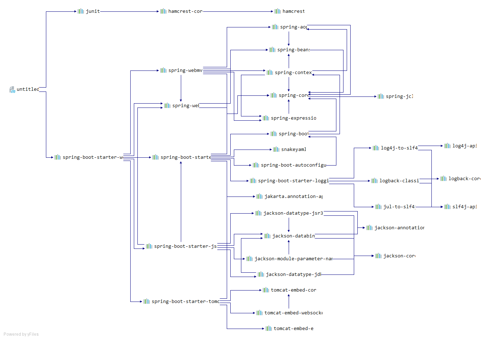

#### 1. SpringBoot特点

##### 1.1 依赖管理机制



+   父项目一般用于依赖管理

    ```xml
      <parent>
        <groupId>org.springframework.boot</groupId>
        <artifactId>spring-boot-starter-parent</artifactId>
        <version>2.5.1</version>
      </parent>
    
    <!-- 父类的父类，包含了几乎所有常用的版本号-->
      <parent>
        <groupId>org.springframework.boot</groupId>
        <artifactId>spring-boot-dependencies</artifactId>
        <version>2.5.1</version>
      </parent>
    
    <!--如果想要自定义修改版本号 1. 查看spring-boot-dependence规定的版本2.在当前项目中重写配置-->
    <properties>
    	<mysql.version>8.0.25</mysql.version>
    </properties>
    ```

+   starter

+   自动版本仲裁

+   可以修改版本号

#### 1.2 自动配置原理

+   自动配置tomcat
+   自动配置SpringMVC
+   自动配好了常见的web功能
+   默认的包扫描
    +   主程序所在的包以及对应的自包都会被自动扫描。
    +   需要想要扫描指定包的路径，可以在@SpringBootApplication(scanBasePackages="com.mingxin")中设置
+   各种配置都有默认值，这些默认值都映射到一个类中
+   按需要求加载依赖项


#### 2. 容器功能

启动类上面的注解是@SpringBootApplication，它也是 Spring Boot 的核心注解，主要组合包含了以下 3 个注解：

`@SpringBootConfiguration`：组合了 @Configuration 注解，实现配置文件的功能。

`@EnableAutoConfiguration`：打开自动配置的功能，也可以关闭某个自动配置的选项，如关闭数据源自动配置功能： @SpringBootApplication(exclude = { DataSourceAutoConfiguration.class })。

`@ComponentScan`：Spring组件扫描。


##### 2.1 @Configuration 配置类

+   proxyBeanMethods=false,表示不使用容器中创建的对象；proxyBeanMethods=true,表示每次使用对象时，都会去容器中去搜索。称为full和lite模式


##### 2.2 @import注解

+   给容器中自动创建出导入类型的组件

    ```java
    @Import({User.class,Jedis.class})
    @Configuration
    public class MyConfig {
        
    }
    
    // 容器中创建了两个对象
    // com.mingxin.bean.User
    // redis.clients.jedis.Jedis
    ```

    

#### 2.3 Conditional

条件装配：满足Conditional指定的条件，则进行组件注入

比如只有当容器中有某个bean的时候才进行注入，@ConditionalOnBean。


##### 2.4 ImportResource

用于将某个xml文件下的bean装载到IoC容器中。

```java
@ImportResouce("classpath:beans.xml")
```

##### 2.5 配置绑定

+    在JavaBean上配置ConfigurationProperties 
    +   注意：
        +   **1** JavaBean上额外配配置Component注解
        +   **2** 或者，在配置类的一个方法上中加上@Bean返回
        +   JavaBean需要配置set方法和get方法
+   或者在MyConfig上进行配置，EnableConfigurationProperties


#### 面试

##### 你如何理解 Spring Boot 中的 Starters?

Starters可以理解为启动器，它包含了一系列可以集成到应用里面的依赖包，你可以一站式集成 Spring 及其他技术，而不需要到处找示例代码和依赖包。