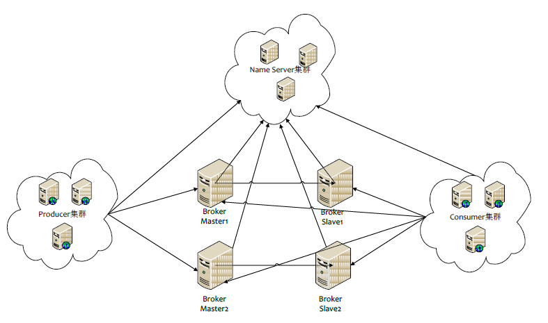
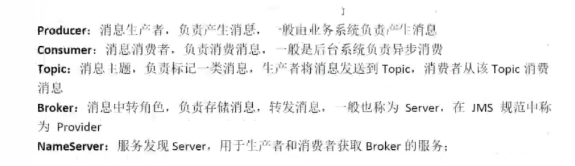

[【原创】分布式之消息队列复习精讲](https://www.cnblogs.com/rjzheng/p/8994962.html)

#### 如何保证消息不被重复消费？

**分析：**这个问题其实换一种问法就是，如何保证消息队列的幂等性?这个问题可以认为是消息队列领域的基本问题。换句话来说，是在考察你的设计能力，这个问题的回答可以根据具体的业务场景来答，没有固定的答案。

**解决方法：**不同的消息队列发送的确认信息形式不同,例如RabbitMQ是发送一个ACK确认消息，RocketMQ是返回一个CONSUME_SUCCESS成功标志，kafka实际上有个offset的概念。

**造成重复消费的问题：**就是因为网络传输等等故障，确认信息没有传送到消息队列，导致消息队列不知道自己已经消费过该消息了，再次将该消息分发给其他的消费者。

**根据业务场景：（保证`幂等性`）**

+   你拿到这个消息做数据库的insert操作。那就容易了，给这个消息做一个唯一主键，那么就算出现重复消费的情况，就会导致主键冲突，避免数据库出现脏数据。
+   你拿到这个消息做redis的set的操作，那就容易了，不用解决，因为你无论set几次结果都是一样的，set操作本来就算**幂等**操作。
+   如果上面两种情况还不行，上大招。准备一个第三方介质,来做消费记录。以redis为例，给消息分配一个全局id，只要消费过该消息，将<id,message>以K-V形式写入redis。那消费者开始消费前，先去redis中查询有没消费记录即可。

#### 如何保证可靠性传输

**分析：**我们在使用消息队列的过程中，应该做到消息不能多消费，也不能少消费。如果无法做到可靠性传输，可能给公司带来千万级别的财产损失。同样的，如果可靠性传输在使用过程中，没有考虑到，这不是给公司挖坑么，你可以拍拍屁股走了，公司损失的钱，谁承担。还是那句话，认真对待每一个项目，不要给公司挖坑。
**回答：**其实这个可靠性传输，每种MQ都要从三个角度来分析:**生产者弄丢数据、消息队列弄丢数据、消费者弄丢数据**

+   生产者丢失数据，ACK信息确认机制。
+   消息队列丢失数据，一般是开启持久化磁盘的配置。
+   消费者丢数据，消费者丢数据一般是因为采用了自动确认消息模式。这种模式下，消费者会自动确认收到信息。这时rahbitMQ会立即将消息删除，这种情况下如果消费者出现异常而没能处理该消息，就会丢失该消息。至于解决方案，采用手动确认消息即可。

#### 消息队列中间件对比

|    特性    |                           ActiveMQ                           |                           RabbitMQ                           |         RocketMQ         |                            kafka                             |
| :--------: | :----------------------------------------------------------: | :----------------------------------------------------------: | :----------------------: | :----------------------------------------------------------: |
|  开发语言  |                             java                             |                            erlang                            |           java           |                            scala                             |
| 单机吞吐量 |                             万级                             |                             万级                             |          10万级          |                            10万级                            |
|   时效性   |                             ms级                             |                             us级                             |           ms级           |                           ms级以内                           |
|   可用性   |                         高(主从架构)                         |                         高(主从架构)                         |    非常高(分布式架构)    |                      非常高(分布式架构)                      |
|  功能特性  | 成熟的产品，在很多公司得到应用；有较多的文档；各种协议支持较好 | 基于erlang开发，所以并发能力很强，性能极其好，延时很低;管理界面较丰富 | MQ功能比较完备，扩展性佳 | 只支持主要的MQ功能，像一些消息查询，消息回溯等功能没有提供，毕竟是为大数据准备的，在大数据领域应用广。 |

#### 如何设计一个消息队列

核心概念就是 `一发一存一消费`

