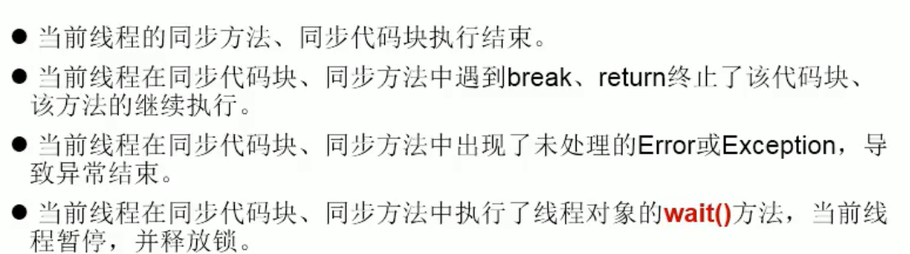
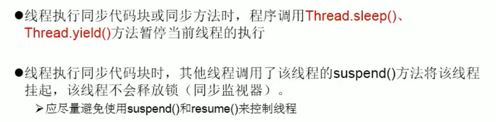
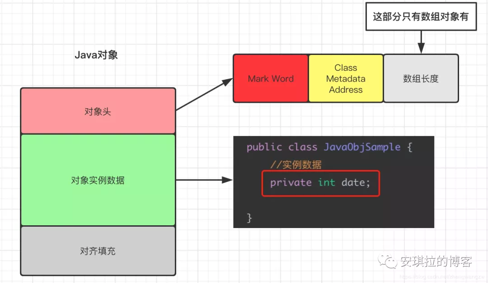
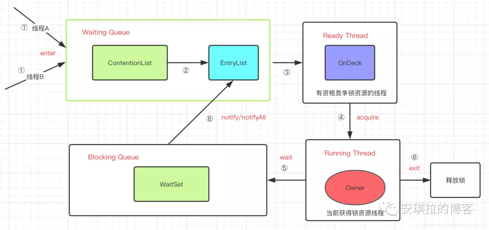

#### 同步Synchronized方法

如果操作共享数据的代码完整的声明在一个方法中，我们不妨将此方法声明同步的。

同步方法仍然涉及到同步监视器，只是不需要我么显示的声明。

```java
 synchronized void sell() { // 这种默认的锁是this，在Runnable中用
     
 }

 synchronized static void sell() { // 这种默认的锁是类.class，在继承Thread中用
     
 }
```

+   synchronized与Lock锁的差异
    +   synchronized是Java语言的关键字，因此是内置特性，Lock不是Java语言内置的，Lock是一个接口，通过实现类可以实现同步访问。
    +   synchronized不需要用户手动释放锁，而Lock需要用户去手动释放锁
    +   synchronized是在JVM层面上实现的，不但可以通过一些监控工具监控synchronized的锁定，而且在代码执行时出现异常，JVM会自动释放锁定，但是使用Lock则不行，lock是通过代码实现的，要保证锁定一定会被释放，就必须将unLock()放到finally{}中
+   Synchronized释放锁的操作



+   Synchronized不释放锁的操作

    


#### Synchronized加锁原理

+   JDK1.6之前

    使用Synchronized修饰，在对应的代码块前后回加上monitorenter和monitorexit，类似于操作系统中的PV操作。

    ```java
    6: monitorenter
    7: aload_2
    8: monitorexit
    ```

+   JDK 1.6以后，引入了偏向锁、轻量锁以及重量锁

>   为了解释这个概念，首先引入`Java对象头`的概念



对象头分为两个部分：`Mark word` 和 `Klass pointer`

| 对象头结构    | 存储信息-说明                                                |
| :------------ | :----------------------------------------------------------- |
| Mark Word     | 存储对象的hashCode、锁信息或分代年龄或GC标志等信息           |
| Klass pointer | 存储指向对象所属类（元数据）的指针，JVM通过这个确定这个对象属于哪个类 |

hash：保存对象的哈希码 
age：保存对象的分代年龄 
biased_lock：偏向锁标识位 
lock：锁状态标识位 
JavaThread*：保存持有偏向锁的线程
ID epoch：保存偏向时间戳。


>   对象实例数据

如上图所示，类中的 成员变量data 就属于对象实例数据；

>   对齐填充

JVM要求对象占用的空间必须是8 的倍数，方便内存分配（以字节为最小单位分配），因此这部分就是用于填满不够的空间凑数用的。


#### Synchronized 的 wait 操作

+   wait操作的原理

这个线程执行到wait方法时，wait方法会将当前线程放入wait set，使其进行等待直到被唤醒，并放弃lock对象上的所有同步声明，意味着该线程释放了锁，其他线程可以重新执行加锁操作，notify方法会选择wait set中任意一个线程进行唤醒，notifyAll方法会唤醒monitor的wait set中所有线程




