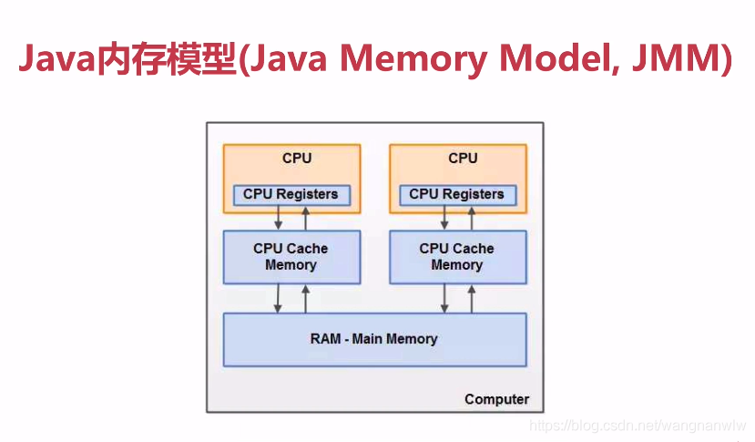
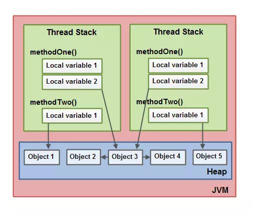
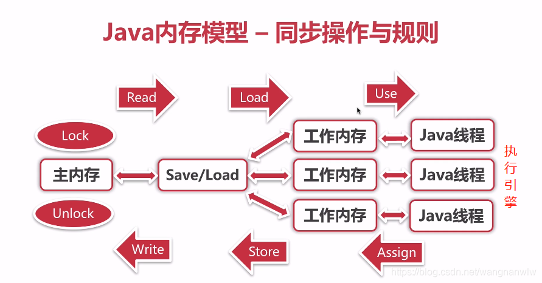
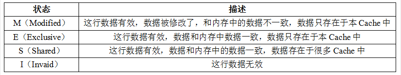

## Java内存模型

**标准答案：**JMM本身是一种抽象的概念，并不真实存在，它描述的是一组规则和规范，通过这组规范定义了程序各个变量的访问方式。从逻辑上，将内存分为了**主内存**和**线程私有的工作内存**，因为JVM运行程序的实体是线程，**而每个线程创建时，JVM都会为其创建一个工作内存（也成栈空间，逻辑上的，包括寄存器和高速缓存），工作内存是每个线程的私有数据区域，而Java内存模型中规定所有的变量都存储在主内存，主内存是共享内存区域，所有线程都可以访问。**但线程对变量的操作（读取赋值）等必须在工作内存中进行，首先要将变量从主内存拷贝到自己的工作内存空间，完成操作后再将数据写回主内存。各个线程不能直接操作主内存中的变量，各个线程中的工作内存中存储着主内存变量的拷贝副本，因此不同的线程间无法访问对方的工作内存，线程间的通信必须通过主内存完成。



#### 1 关于变量存放的位置

调用栈和本地变量存放在线程栈上，对象存放在堆上。



-   一个本地变量可能是原始类型，在这种情况下，它总是“呆在”线程栈上。
-   一个本地变量也可能是指向一个对象的一个引用。在这种情况下，引用（这个本地变量）存放在线程栈上，但是对象本身存放在堆上。
-   一个对象可能包含方法，这些方法可能包含本地变量。这些本地变量仍然存放在线程栈上，即使这些方法所属的对象存放在堆上。
-   一个对象的成员变量可能随着这个对象自身存放在堆上。不管这个成员变量是原始类型还是引用类型。
-   静态成员变量跟随着类定义一起也存放在堆上。
-   存放在堆上的对象可以被所有持有对这个对象引用的线程访问。当一个线程可以访问一个对象时，它也可以访问这个对象的成员变量。如果两个线程同时调用同一个对象上的同一个方法，它们将会都访问这个对象的成员变量，但是每一个线程都拥有这个成员变量的私有拷贝。


####  2 同步八种操作

+   lock(锁定):作用于主内存的变量,把一个变量标识为一条线程独占状态
+   unlock(解锁):作用于主内存的变量,把一个处于锁定状态的变量释放出来 , 释放后的变量才可以被其他线程锁定unlock(解锁):作用于主内存的变量,把一个处于锁定状态的变量释放出来 , 释放后的变量才可以被其他线程锁定
+   read(读取) : 作用于主内存的变量 , 把一个变量值从主内存传输到线程的工作内存中,以便随后的load动作使用read(读取) : 作用于主内存的变量 , 把一个变量值从主内存传输到线程的工作内存中,以便随后的load动作使用
+   load(载入)：作用域工作内存的变量，它把read操作从主内存中得到的变量值放入工作内存的变量副本中load(载入)：作用域工作内存的变量，它把read操作从主内存中得到的变量值放入工作内存的变量副本中
+   use (使用) : 作用于工作内存的变量 , 把工作内存中的一个变量值传递给执行引擎use (使用) : 作用于工作内存的变量 , 把工作内存中的一个变量值传递给执行引擎
+   assign(赋值):作用于工作内存的变量,它把一个从执行引擎接收到的值赋值给工作内存的变量
+   store (存储) : 作用于工作内存的变量 , 把工作内存中的一个变量的值传送到主内存中 , 以便随后的write的操作
+   write (写入) : 作用于主内存的变量, 它把store操作从工作内存中一个变量的值传送到主内存的变量中



#### 3. `MESI`缓存一致性协议

如何保证各个CPU缓存中的数据是一致的，就是CPU的缓存一致性问题。



CPU缓存会遵守几个规则：

```shell
🐍 只有当缓存行处于E或者M状态时，处理器是独占这个缓存行的。🐍

当处理器想写某个缓存行时，如果它没有独占权，它必须先发送一条"我要独占权"的请求给总线，这会通知其它处理器把它们拥有的同一缓存段的拷贝失效（如果有）。

🐍 只有在获得独占权后，处理器才能开始修改数据 🐍，这个缓存行只有一份拷贝，在我自己的缓存里，所以不会有任何冲突。

反之，如果有其它处理器想读取这个缓存行（马上能知道，因为一直在嗅探总线），独占或已修改的缓存行必须先回到"共享"状态。如果是已修改的缓存行，那么还要先把内容回写到内存中。
```

+   **总线锁**

当一个CPU对其缓存中的数据进行操作的时候，向总线中发送了一个Lock信号，其他处理器的请求会被阻塞，那么该处理器可以独占共享内存。

+   **缓存锁**

如果缓存在处理器缓存行中的内存区域在 LOCK 操作期间被锁定，当它执行锁操作回写内存时，缓存一致性机制会保证其他CPU缓存中的该数据失效，当其他线程需要操作该数据时，需要从新从主内存中读取数据。


#### 4 并发编程三大特性

##### 4.1 原子性

一个操作不能被打断，要么全部执行，要么都不执行。

##### 4.2 可见性

一个线程对共享变量做了修改之后，其他的线程立即能看到这变量的修改。

java内存模型通过将工作内存中的变量修改后同步到主内存，在读取变量前，从主内存刷新值到工作内存中，这种依赖主内存的方式来实现可见性。

普通变量和volatile变量都是如此，区别在于volatile保证了volatile变量修改后的新值立刻刷新到主内存中（保证了多线程下的可见性），而普通变量不行。

而synchronized、Lock以及final关键字都可以实现可见性。

##### 4.3 有序性

java提供了两个关键字来（volatile和synchronized）来保证多线程之间操作的有序性：

-   volatile关键字本身通过加入内存屏障来禁止指令的重排序，
-   而synchronized关键字通过一个变量在同一时间只允许有一个线程对其进行加锁的规则来实现

而关于有序性，这又涉及到**`指令重排、内存屏障和happens-before原则`**。


