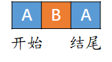

## CAS

```shell
基本流程:
CAS --> UnSafe --> CAS 底层思想 --> ABA ---> 原子引用更新 ---> 如何规避ABA问题
```

CAS：比较当前工作内存中的值和主内存中的值，如果相同则执行更新操作。

UnSafe是rt中提供的一个类, 其中提供了一个方法`compareAndSwapInt`

CAS 底层思想: 操作包含三个操作数 —— 内存位置（V）、预期原值（A）和新值(B), 如果内存位置等于预期位置, 则更新为新的值. 


#### 源码解析

原子性靠的是`unsafe`类。

```java
public final int getAndAddInt(Object var1, long var2, int var4) {
    /*
        @param var1 表示的是Atomic对象
        @param var2表示的是偏移量
        @param var4表示的加上去的值
    */
    int var5; 
    do {
        var5 = this.getIntVolatile(var1, var2); // 先获取当前的值，对象加上偏移量
        /* 过了一会儿 */
    } while(!this.compareAndSwapInt(var1, var2, var5, var5 + var4));  // 底层保证了原子性
    // 如果偏移地址中的数据等于快照值，则更新数据

    return var5;
}
```

优点：这里通过`do-while`，没有加锁，其他线程可以继续操作，当前线程只需要**从主内存中读取**并持**续进行比较即可**。

缺点：

+   需要频繁比较，浪费CPU资源
+   只能保证**一个**共享变量的原子性
+   引出**ABA问题**


#### AtomicReference 以及 AtomicStampedReference

用于设置自己的类为原子类型

```java
public void method2() {
	AtomicReference<User> atomicReference = new AtomicReference<>();
	atomicReference.compareAndSet(obj1,obj2);
}
```


#### ABA问题



ABA问题定义，时间差导致的问题

```markdown
1.假设主内存有变量A=0，现在2个线程都准备执行compareAndSet(0, 10)
2.由于线程2的执行速度较快，把A改成10，然后又改成了20，最后又改成10
3.此时线程1也正准备执行，因为主内存A=10，线程1中也是A=10，就以为当前变量A没人操作过，所以线程1的compareAndSet也执行成功了
4.表面上看似乎也没什么问题，但是这个现象，在特定的业务条件下可能就会导致Bug
```

**解决方法**：新增一种机制，时间戳原子引用，那就是修新增版本号，类似乐观锁，AtomicStamped

```java
public class ABATest {
    static AtomicReference<Integer> atomicReference = new AtomicReference<Integer>(10);
    static AtomicStampedReference<Integer> atomicStampedReference = new AtomicStampedReference<Integer>(10,1);
    public static void main(String[] args) throws InterruptedException {
        // 没有解决ABA问题的原子类
        new Thread() {
            @Override
            public void run() {
                atomicReference.compareAndSet(10,11);
                atomicReference.compareAndSet(11,10);
            }
        }.start();
        new Thread() {
            @Override
            public void run() {
                try {  TimeUnit.SECONDS.sleep(1);  } catch (InterruptedException e) { e.printStackTrace(); }
                System.out.println(atomicReference.compareAndSet(10, 2019)+"\t"+atomicReference.get());
            }
        }.start();

        TimeUnit.SECONDS.sleep(1);
        
		// 解决ABA问题的原子类
        new Thread() {
            @Override
            public void run() {
                atomicStampedReference.compareAndSet(10,11,1,2);
                atomicStampedReference.compareAndSet(11,10,2,3);
            }
        }.start();
        
        new Thread() {
            @Override
            public void run() {
                try {  TimeUnit.SECONDS.sleep(1);  } catch (InterruptedException e) { e.printStackTrace(); }
                System.out.println(atomicStampedReference.compareAndSet(10, 2019,1,2)+"\t"+atomicReference.get());
            }
        }.start();
    }
}
```

