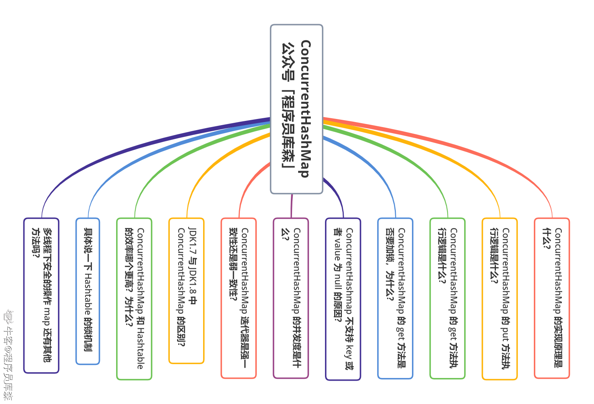
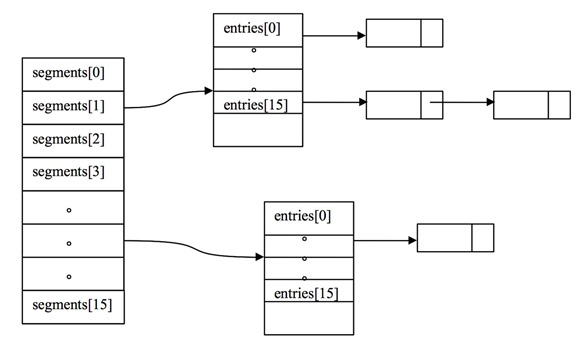
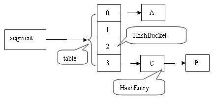
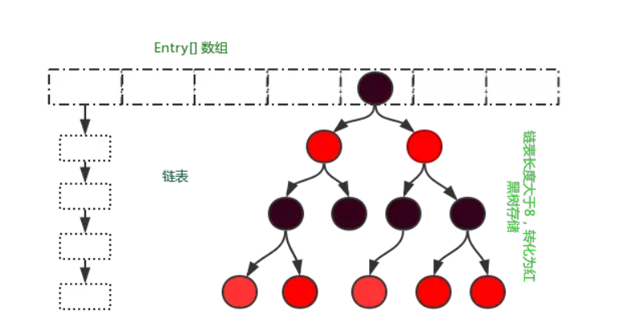

## List 列表

ArrayList和LinkedList都是线程不安全的，导致线程安全的原因在于，在对列表进行写操作的时候，另外的线程进行抢夺，导致数据不一致异常。

+   而Vector是线程安全的

+   Collections.synchronizedList(new ArrayList<>()) 也是线程安全的

+   CopyOnWriteArrayList

    

## Set集合

hashset的底层实现是hashmap，只不过hashset在add的时候，value是一个final的object对象。

+   Collections.synchronizedSet(new HashSet<>())
+   CopyOnWriteSet


## Map数据结构

#### Collections.sychronizedMap

sychronizedMap方法中定义了一个`SynchronizedMap`类，而这个类中定义了一个普通的`Map`和互斥锁对象`mutex`，内部所有的操作都需要加上锁。

```java
private final Map<K,V> m;
final object mutex;

SynchronizedMap(Map<k,v> m) {
    mutex = this;
}

public int size() {
	synchronized(mutex) {return m.size();}
}
```


#### Hashtable

对所有的方法直接加上了Sychronized关键字。

Hashtable和HashMap的区别：

+ Hashtable 是不允许键或值为 null 的，HashMap 的键值则都可以为 null。[为什么不能存储null值？因为在多线程下，无法判断是 `key不存在` 还是 存储的值是`null` ]

+ Hashtable 不是 `fail-fast` 的，HashMap是 `fail-fast`的。[ `fail-fast` 表示的含义是迭代器遍历一个集合对象时，如果遍历过程对集合对象的内容进行修改了，则会报 `ConcurrentModificationExpe-ction` 错误。java.util下面的都是快速失败[fail-fast]的，而java.util.current包下面的都是安全失败[fail-save]的。]

#### CurrentHashMap 

>   来源：[nowcoder](https://www.nowcoder.com/discuss/591527?source_id=profile_create_nctrack&channel=-1)




>   ConcurrentHashMap的基本数据结构

+   JDK 1.7 



```java
static final class Segment<K,V> extends ReentrantLock implements Serializable {
    transient volatile HashEntry<K,V>[] table;
    transient int count;
    transient int modCount;
    transient int threshold;
    final float loadFactor;
 }

static final class HashEntry<K,V> {
    /*
    *	 用 volatile 修饰了 HashEntry 的数据 value 和 下一个节点 next，
	*    保证了多线程环境下数据获取时的可见性！
    */
    final int hash;
    final K key;
    volatile V value;
    volatile HashEntry<K,V> next;
}

```

ConcurrentHashMap类中包含两个静态内部类 `HashEntry `和` Segment`，其中 HashEntry 用来封装具体的K/V对，是个典型的四元组；Segment 用来充当锁（继承ReentrantLock）的角色，每个 Segment 对象守护整个ConcurrentHashMap的若干个桶 (可以把Segment看作是一个小型的哈希表)，其中每个桶是由若干个 HashEntry 对象链接起来的链表。
特别地，ConcurrentHashMap 在默认并发级别下会创建16个Segment对象的数组，如果键能均匀散列，每个 Segment 大约守护整个散列表中桶总数的 1/16。
ConcurrentHashMap中，无论是读操作还是写操作都能保证很高的性能：在进行读操作时(几乎)不需要加锁，而在写操作时通过`锁分段技术`只对所操作的段加锁而不影响客户端对其它段的访问。



+   JDK 1.8



在数据结构上， JDK1.8 中的ConcurrentHashMap 选择了与 HashMap 相同的Node数组+链表+红黑树结构；在锁的实现上，抛弃了原有的 Segment 分段锁，采用CAS + synchronized实现更加细粒度的锁。

将锁的级别控制在了更细粒度的哈希桶数组元素级别，也就是说只需要锁住这个链表头节点（红黑树的根节点），就不会影响其他的哈希桶数组元素的读写，大大提高了并发度。

```java
static class Node<K,V> implements Map.Entry<K,V> {
    final int hash;
    final K key;
    volatile V val; // 保证数据可见性
    volatile Node<K,V> next;
}
```

>   ConcurrentHashMap 的 put 方法执行逻辑是什么？

+   JDK 1.7 

1.  尝试自旋获取锁。
2.  如果重试的次数达到了 MAX_SCAN_RETRIES 则改为**阻塞锁**获取，保证能获取成功。[锁升级]

```java
final V put(K key, int hash, V value, boolean onlyIfAbsent) {
    // 加锁，利用 scanAndLockForPut() 自旋获取锁
    HashEntry<K,V> node = tryLock() ? null : scanAndLockForPut(key, hash, value);
    try {
        // ...
    } finally {
        unlock();
    }
    return oldValue;
}
```

+   JDK 1.8 

1. 根据 key 计算出 hash 值；
2. 判断是否需要进行初始化；
3. 定位到 Node，拿到首节点 f，判断首节点 f：
    如果为 null ，则通过 CAS 的方式尝试添加；
    如果为 f.hash = MOVED = -1 ，说明其他线程在扩容，参与一起扩容；
    如果都不满足 ，synchronized 锁住 f 节点，判断是链表还是红黑树，遍历插入；
4. 当在链表长度达到 8 的时候，数组扩容或者将链表转换为红黑树。


>   ConcurrentHashMap 的 get 方法执行逻辑是什么？

+   JDK 1.7 

首先，根据 key 计算出 hash 值定位到具体的 Segment ，再根据 hash 值获取定位 HashEntry 对象，并对 HashEntry 对象进行链表遍历，找到对应元素。内部值采用的是volatile，保证了内存可见性，所以每次获取的都是最新值，这也保证了ConcurrentHashMap的`get方法不需要加锁`，因为通过了volatile修饰。

+   JDK 1.8

JDK 1.8中Node的value数据和next指针都是用volatile修饰的,保证了数据的可见性,每次获取的数据都是最新值。


>   ConcurrentHashMap 的并发度如何 ？

JDK 1.7 中，依赖于Segment数组的大小，默认为16；

JDK 1.8 中，依赖于Node数组的大小，默认为16；


>   JDK1.7 与 JDK1.8 中ConcurrentHashMap 的区别？

**数据结构：**取消了 Segment 分段锁的数据结构，取而代之的是数组+链表+红黑树的结构。

**保证线程安全机制：**JDK1.7 采用 Segment 的分段锁机制实现线程安全，其中 Segment 继承自 ReentrantLock 。JDK1.8 采用CAS+synchronized保证线程安全。

**锁的粒度：**JDK1.7 是对需要进行数据操作的 Segment 加锁，JDK1.8 调整为对每个数组元素加锁（Node）。

**链表转化为红黑树：**定位节点的 hash 算法简化会带来弊端，hash 冲突加剧，因此在链表节点数量大于 8（且数据总量大于等于 64）时，会将链表转化为红黑树进行存储。

**查询时间复杂度：**从 JDK1.7的遍历链表O(n)， JDK1.8 变成遍历红黑树O(logN)。


>   JDK1.8 中为什么使用内置锁 synchronized替换 可重入锁 ReentrantLock？

在 JDK1.6 中，对 synchronized 锁的实现引入了大量的优化，并且 synchronized 有多种锁状态，会从无锁 -> 偏向锁 -> 轻量级锁 -> 重量级锁一步步转换。 

针对 synchronized 获取锁的方式，JVM 使用了锁升级的优化方式，就是先使用**偏向锁**优先同一线程然后再次获取锁，如果失败，就升级为 **CAS 轻量级锁**，如果失败就会短暂**自旋**，防止线程被系统挂起。最后如果以上都失败就升级为**重量级锁**。

 减少内存开销 。假设使用可重入锁来获得同步支持，那么每个节点都需要通过继承 AQS 来获得同步支持。但并不是每个节点都需要获得同步支持的，只有[链表]()的头节点（[红黑树]()的根节点）需要同步，这无疑带来了巨大内存浪费。


>   ConcurrentHashMap读操作不需要加锁的奥秘在于以下三点：

-   **用HashEntery对象的不变性来降低读操作对加锁的需求；**
-   **用Volatile变量协调读写线程间的内存可见性；**
-   **若读时发生指令重排序现象，则加锁重读；**

