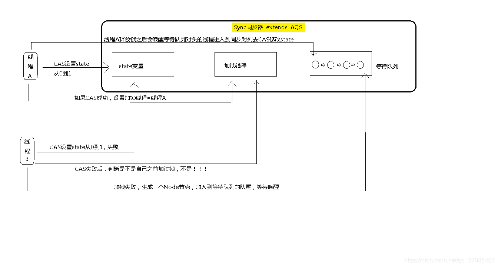
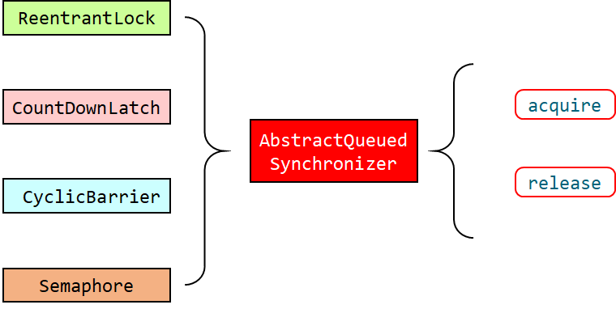

## 工具包

#### AQS的原理 [🔗](https://www.cnblogs.com/waterystone/p/4920797.html)

AQS全称: AbstractQueuedSynchronizer

>   AQS的基本原理

AQS维护了一个volatile的state和一个FIFO等待队列，底层也利用到`compareAndSet`。


链表中的每一个节点称为一个`Node`, Node结点是对每一个等待获取资源的线程的封装, `waitStatus`表明了当前Node节点的等待状态,  共有5种取值CANCELLED、SIGNAL、CONDITION、PROPAGATE、0

+   当前节点由于超时或中断被取消        static final int CANCELLED =  1;
+   表示当前节点的前节点被阻塞        static final int SIGNAL    = -1;
+   当前节点在等待condition        static final int CONDITION = -2;
+   共享享模式下，前继结点不仅会唤醒其后继结点，同时也可能会唤醒后继的后继结点  static final int PROPAGATE = -3;
+   新节点入队时的默认状态  0



>   AQS下面的整体结构



如果该工具类是独占方式, 比如ReentrantLock 只需要实现: tryAcquire-tryRelease

如果该工具类是共享方式, 比如CountDownLatch 只需要实现: tryAcquire-tryRelease

如果是读写锁, 比如 ReentrantReadWriteLock, 可以同时实现 tryAcquire-tryRelease、tryAcquireShared-tryReleaseShared


>   AQS的acquire过程


可重入锁的lock函数就是一条acquire.

流程:
    1.  调用自定义同步器的tryAcquire()尝试直接去获取资源，如果成功则直接返回；
        2.  没成功，则addWaiter()将该线程加入等待队列的尾部，并标记为独占模式；
            3.  acquireQueued()使线程在等待队列中休息，有机会时（轮到自己，会被unpark()）会去尝试获取资源。获取到资源后才返回。如果在整个等待过程中被中断过，则返回true，否则返回false。
                4.  如果线程在等待过程中被中断过，它是不响应的。只是获取资源后才再进行自我中断selfInterrupt()，将中断补上。

>   AQS的release过程

这些工具类会调用AQS的release方法, 首先释放状态资源, 然后唤醒等待队列的下一个线程. 

```java
    public final boolean release(int arg) {
        if (tryRelease(arg)) { // 先去释放状态资源
            Node h = head;
            if (h != null && h.waitStatus != 0)
                unparkSuccessor(h); // 唤醒等待队列的下一个线程
            return true;
        }
        return false;
    }
```


#### CountDownLatch

+   到计数
+   做减法
+   countDownLatch这个类使一个线程`等待`其他线程`各自执行完毕后`再执行。

```java
public class CountDownLatchTest {
    public static void main(String[] args) throws InterruptedException {
        CountDownLatch countDownLatch = new CountDownLatch(6);

        for (int i = 0; i < 6; i++) {
            new Thread(() -> {
                System.out.println(Thread.currentThread().getName() + "\t" + "上完自习，离开教师");
                countDownLatch.countDown();
            }).start();
        }
        
        countDownLatch.await();
        System.out.println(Thread.currentThread().getName() + "\t上完自习，关闭教室");
    }
}
```


#### CyclicBarrier

+   循环阻碍
+   做加法
+   可以重置后,进行复用
+   CyclicBarrier一般用于一组线程互相等待至某个状态，然后这一组线程再同时执行

```java
public class CyclicBarrierTest {
    public static void main(String[] args) {
        CyclicBarrier cyclicBarrier = new CyclicBarrier(7, () -> {
            System.out.println("召唤神龙");
        });

        for (int i = 0; i < 7; i++) {
            final int tempInt = i;
            new Thread(()-> {
                System.out.println(Thread.currentThread().getName() + "\t" + "收集到第：" + (tempInt+1) + "颗龙珠");
                try {
                    cyclicBarrier.await();
                } catch (InterruptedException e) {
                    e.printStackTrace();
                } catch (BrokenBarrierException e) {
                    e.printStackTrace();
                }
            }).start();
        }
    }
}
```


#### Semaphore

Semaphore(信号量)：是一种计数器，用来保护一个或者多个共享资源的访问

```java
// 抢车位例子
public class SemaphoreTest {
    public static void main(String[] args) {
        Semaphore semaphore1 = new Semaphore(6);

        for (int i = 0; i < 20; i++) {
            new Thread(()->{
                try {
                    System.out.println(Thread.currentThread().getName() + ", 尝试获取车位");
                    semaphore1.acquire();
                    System.out.println(Thread.currentThread().getName() + ", 成功获取, 正在使用");
                    TimeUnit.SECONDS.sleep(1);
                } catch (InterruptedException e) {
                    e.printStackTrace();
                } finally {
                    semaphore1.release();
                    System.out.println(Thread.currentThread().getName() + ", 释放");
                }
            }).start();
        }
    }
}
```

