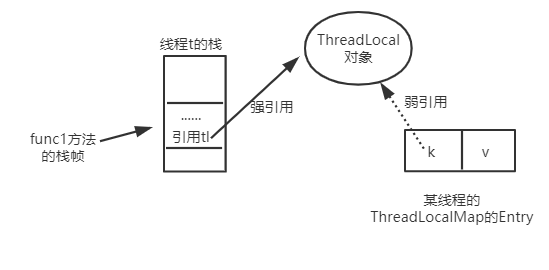

## 1 ThreadLocal写法实例

#### 1.1 写法一：

```java
class DateUtil {
    private static ThreadLocal<DateFormat> threadLocal = new ThreadLocal<DateFormat>() {
        @Override
        protected DateFormat initialValue() {
            return new SimpleDateFormat("yyyy-MM-dd HH:mm:ss");
        }
    };

    public static  String formatDate(Date date)throws ParseException {
        return threadLocal.get().format(date);
    }

    public static  Date parse(String strDate) throws ParseException{
        return threadLocal.get().parse(strDate);
    }
}
```


#### 1.2 写法二：

```java
class DateUtil {
    private static ThreadLocal<DateFormat> threadLocal = new ThreadLocal<DateFormat>();

    public static DateFormat getDateFormate() {
        DateFormat df = threadLocal.get();
        if(df == null) {
            df = new SimpleDateFormat("yyyy-MM-dd HH:mm:ss");
            threadLocal.set(df);
        }
        return df;
    }
    public static  String formatDate(Date date)throws ParseException {
        return getDateFormate().format(date);
    }

    public static  Date parse(String strDate) throws ParseException{
        return getDateFormate().parse(strDate);
    }
}
```


## 2 ThreadLocal内存泄漏问题


上图中，实线代表强引用，虚线代表的是弱引用。一旦发生GC，那么弱引用对象（key）会被回收，此时 `Entry` 中就变成了`[null,value]`，如果线程不结束，就会一致存在一条强引用链 `Thread Ref -> Thread -> ThreaLocalMap -> Entry ->value`，造成内存泄漏。

#### 2.1 如何解决内存泄漏问题

利用`key`弱引用，解决key的内存泄漏问题。


#### 2.2 Entry的key为什么使用弱引用

```java
static class Entry extends WeakReference<ThreadLocal<?>> {
    /** The value associated with this ThreadLocal. */
    Object value;

    Entry(ThreadLocal<?> k, Object v) {
        super(k);  //由于Entry继承了WeakReference，所以这里以一个弱引用指向ThreadLcoal对象
        value = v;
    }
}
```

为什么这里需要弱引用呢？举个简单的例子：

```java
public void func1() {
    ThreadLocal tl = new ThreadLocal<Integer>(); //line1
    tl.set(100);   //line2
    tl.get();      //line3
}
```

`line1`新建了一个`ThreadLocal`对象，`t1 `是强引用指向这个对象；`line2`调用`set()`后，新建一个`Entry`，通过源码可知`Entry`对象里的 `k`是弱引用指向这个对象。如图：



当`func1`方法执行完毕后，栈帧销毁，强引用 `tl `也就没有了，但此时线程的`ThreadLocalMap`里某个`entry`的 `k `引用还指向这个对象。若这个`k `引用是强引用，就会导致 `k` 指向的`ThreadLocal`对象及`v`指向的对象不能被`gc`回收，造成内存泄漏。

**概括说就是：**在方法中新建一个`ThreadLocal`对象，就有一个强引用指向它，在调用`set()`后，线程的`ThreadLocalMap`对象里的`Entry`对象又有一个引用 `k` 指向它。如果后面这个引用 `k `是强引用就会使方法执行完，栈帧中的强引用销毁了，对象还不能回收，造成严重的内存泄露。

#### 2.3 如何解决脏数据问题 🍉

如果不是采用线程池，那么每个线程创建和结束都会销毁对应的缓存信息。但是如果在高并发场景下，创建了线程池，那么如果不显式地利用`remove`方法删除`ThreadLocalMap`中`ThreadLocal`的信息，那么当从线程池中取出数据时，很有可能会造成脏读现象（读取上一个线程缓存的的信息）。

所以在每次使用之后，利用remove方法，释放对其的引用关系。

## 3 ThreadLocal共享

如何在子父进程之间进行共享：

+ 在父进程中定义一个InheritableThreadLocal变量

理解

+ CopyValueIntoEveryThread

    

  ​    