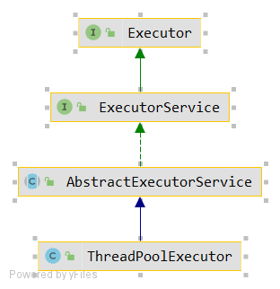

## 线程池

#### Callable 接口

+   继承Callable接口
+   定义FutureTask对象, 并传入Callable对象
+   定义Thread, 并传入FutureTask对象
+   启动Thread
+   通过FutureTask阻塞获取返回结果


#### 线程池的优势



+   适用于经常创建和销毁、使用量比较大的资源，比如并发情况下的线程，对性能影响很大。
+   提前创建好多个线程，放入线程池中，使用时直接获取，使用完放回池中，避免频繁创建销毁。
+   好处：
    +   提高响应速度
    +   降低资源消耗
    +   便于线程管理 （corePoolSize、maximumPoolSize、keepAliveTime）

#### 线程池例子

其中ExecutorService是一个接口，下面实际上是一种类型提升，实际上实现的类是：

```java
ThreadPoolExecutor executorService = (ThreadPoolExecutor) Executors.newFixedThreadPool(10);
```

```java
class MyThread implements Callable {
    @Override
    public Object call() throws Exception {
        System.out.println(Thread.currentThread().getName());
        int sum = 0;
        for (int i = 0; i < 100; i++) {
            sum += i;
        }
        return sum;
    }
}

public class ThreadPool {
    public static void main(String[] args) throws ExecutionException, InterruptedException {
        ExecutorService executorService = Executors.newFixedThreadPool(10); // 多态的体现
        MyThread number = new MyThread();

        FutureTask futureTask1 = new FutureTask(number);
        FutureTask futureTask2 = new FutureTask(number);
        executorService.submit(futureTask1);
        executorService.submit(futureTask2);

        Object obj = futureTask1.get();
        System.out.println(obj);

        Object obj2 = futureTask2.get();
        System.out.println(obj2);

        executorService.shutdown();
    }
}
```


#### 线程池的基本原理


当创建线程池之后，线程池中并不存在线程（除非预先设置）。

1.  当一个任务提交时，如果corepool中的核心线程小于`CorePoolSize`，那么线程池创建一个线程执行任务；

2.  如果corepool中没有`空闲的线程`，那么加入`BlockingQueue`等待核心线程拉取任务执行

3.  如果`BlockQueue`已满

    3.1 如果正在运行的线程数量小于`maximumPoolSize`，那么需要创建非核心线程来执行当前任务【相当于临时工】。

    3.2 如果正在运行的线程数量大于的等于`maximumPoolSize`，那么需要**执行拒绝策略**。

4.  当一个线程完成任务，会从阻塞队列中获取下一个任务执行。

5.  如果线程长时间（keepAliveTime）无任务可做，线程池会判断：

    5.1 如果当前运行的线程数大于`corePoolSize`，那么当前线程会被停掉

    5.2 所以线程池的大小最终会收缩到`corePoolSize`。


#### 线程池3种创建方式

>   生成只包含一个线程的线程池：Executors.newSingleExecutor()

```java
ThreadPoolExecutor executorService = (ThreadPoolExecutor) Executors.newSingleThreadExecutor();


public static ExecutorService newSingleThreadExecutor() {
    return new FinalizableDelegatedExecutorService
        (new ThreadPoolExecutor(1, 1,
                                0L, TimeUnit.MILLISECONDS,
                                new LinkedBlockingQueue<Runnable>()));
}
```


>   固定数线程：Executors.newFixedThreadPool(10)

```java
ThreadPoolExecutor executorService = (ThreadPoolExecutor) Executors.newFixedThreadPool(10);

public static ExecutorService newCachedThreadPool(ThreadFactory threadFactory) {
    return new ThreadPoolExecutor(0, Integer.MAX_VALUE,
                                  60L, TimeUnit.SECONDS,
                                  new SynchronousQueue<Runnable>(),
                                  threadFactory);
}
```


>   生成不限数量的线程池：Exectuors.newCachedThreadPool()

```java
ThreadPoolExecutor executorService = (ThreadPoolExecutor) Executors.newCachedThreadPool();

public static ExecutorService newCachedThreadPool() {
    return new ThreadPoolExecutor(0, Integer.MAX_VALUE,
                                  60L, TimeUnit.SECONDS,
                                  new SynchronousQueue<Runnable>());
}
```


#### 线程池的7大参数简介

> 1 - corePoolSize ~ 线程池基本大小

核心池的大小，这个参数对于线程池的实现原理由很大关系。

默认情况下，在创建了线程池后，线程池中的线程数为0，当有任务来之后，就会创建一个线程去执行任务，当线程池中的线程数目达到corePoolSize后，就会把到达的任务放到缓存队列当中；

>   2 - maximumPoolSize ~ 线程池的最大数量

线程池允许的最大线程数量，如果线程池中的线程数量等于`CorePoolSize`并且`阻塞队列已满`，则尝试在线程池中继续创建线程执行任务。

>   3 - RejectedExecutionHandler ~ 拒绝策略 

+   AbortPolicy 直接抛出异常

```java
    public static class AbortPolicy implements RejectedExecutionHandler {
        public AbortPolicy() { }
        // 直接抛出一个异常
        public void rejectedExecution(Runnable r, ThreadPoolExecutor e) {
            throw new RejectedExecutionException("Task " + r.toString() +
                                                 " rejected from " +
                                                 e.toString());
        }
    }
```

+   CallerRunsPolicy  使用调用者线程执行任务

```java
    public static class CallerRunsPolicy implements RejectedExecutionHandler {
        public CallerRunsPolicy() { }

        public void rejectedExecution(Runnable r, ThreadPoolExecutor e) {
            if (!e.isShutdown()) {
                r.run(); // 谁调用的，谁运行（直接run，而不是start）
            }
        }
    }
```

+   DiscardOldestPolicy 抛弃掉最老的任务

```java
public static class DiscardOldestPolicy implements RejectedExecutionHandler {
        public DiscardOldestPolicy() { }

        public void rejectedExecution(Runnable r, ThreadPoolExecutor e) {
            if (!e.isShutdown()) {
                e.getQueue().poll(); // 从队列中取出队首
                e.execute(r); // 再执行当前任务
            }
        }
    }
```

+   DiscardPolicy 直接抛弃当前任务

```java
    public static class DiscardPolicy implements RejectedExecutionHandler {
        public DiscardPolicy() { }
        public void rejectedExecution(Runnable r, ThreadPoolExecutor e) {
             // 啥也不干，直接抛弃当前任务
        }
    }
```


>   4 - keepAliveTime 线程活动生命时长

线程池的工作线程空闲后可以保持存活的时长。


>   5 - TimeUnit（生命时长的计算单位）

`DAYS`/`HOURS`/`MINUTES`/`MILLISECONDS`(毫秒)/`MICROSECONDS`(微秒)/`NANOSECONDS`(纳秒)


>   6 - workQueue（ 任务阻塞队列）

保存等待执行的任务队列，可以使用任意阻塞队列，例如`ArrayBlockingQueue`, `LinkedBlockingQueue`, `PriorityBlockingQueue`, `SynchronousQueue`


>   7 - threadFactory （创建线程的工厂）

给每个线程设置更有意义的名字的一个工厂，例如`ThreadFactoryBuilder`工厂


#### 面试题，你在运用工程中采用哪种方式创建线程池

阿里巴巴手册中建议采用：`ThreadPoolExecutor` 创建，可以让同学更加明确线程池的创建规则。


#### 面试题，如何合理配置线程池的大小

如果是CPU密集型任务，就需要尽量压榨CPU，参考值可以设为 $N_{CPU+1}$

如果是IO密集型任务，参考值可以设置为$2\times N_{CPU}$

#### 面试题，线程池如何回收线程

  总的来说，ThreadPoolExecutor回收线程都是等getTask()获取不到任务，返回null时，调用processWorkerExit方法从Set集合中remove掉线程，getTask()返回null又分为2两种场景：

​    \1. 线程正常执行完任务，并且已经等到超过keepAliveTime时间，大于核心线程数，那么会返回null，结束外层的runWorker中的while循环

​    \2. 当调用shutdown()方法，会将线程池状态置为shutdown，并且需要等待正在执行的任务执行完，阻塞队列中的任务执行完才能返回null

在工作中，一直认为编程代码不是最重要的，重要的是在工作中所养成的编程思维。


## ForkJoinPool

#### ForkJoinPool介绍

明确：ForkJoinPool适合CPU密集型的任务。

`ForkJoinPool `线程池在 `JDK8` 加入，主要用法和之前的线程池是相同的，也是把任务交给线程池去执行，线程池中也有任务队列来存放任务，和之前的五种线程池不同的是，它非常适合执行可以分解子任务的任务。

**分治法：**这种描述类似于单机版本的 `map-reduce`，都是采用了分治算法，将大人物拆分到可执行的任务，之后并行执行，区别在于Forkjoin可能只能在单个jvm上运行，而map-reduce则是在集群上执行。除此之外，ForkjoinPool采用**工作窃取算法**，会从其他线程的双端队列的末端`窃取`其他线程未执行完的任务，以避免工作线程由于拆分了任务之后的`join`等待过程，


```java
public class App <T> {
    public static void main(String[] args) throws ExecutionException, InterruptedException {
        ForkJoinPool forkJoinPool = new ForkJoinPool();
        int count = 10;
        for (int i = 0; i < count; i++) {
            ForkJoinTask<Integer> task = forkJoinPool.submit(new Fibonacci(i));
            System.out.println(task.get());
        }
    }
}

class Fibonacci extends RecursiveTask<Integer> {
    int n;
    public Fibonacci(int n) {
        this.n = n;
    }

    @Override
    protected Integer compute() {
        if(n <= 1) return n;
        Fibonacci task1 = new Fibonacci(n - 1);
        task1.fork();
        Fibonacci task2 = new Fibonacci(n - 1);
        task2.fork();
        return task1.join() + task1.join();
    }
}
```


#### ForkJoinPool与线程池的区别

首先对于线程池，一般使用 `ThreadPoolExecutor` 来实现，而他们都实现了接口 `AbstractExecutorService`：


+   `ThreadPoolExecutor`  的实现原理，本质上就是`生产者/消费者`模式，消费者从一个共享的`Task Queue`中消费提交的任务，`ThreadPoolExecutor `简单的并行操作主要是为了**执行时间不确定的任务**（`I/O 或定时任务等`）。

    

+   `ForkJoinPool` 采用了多个`Task Queue` 的形式，每个线程都拥有自己的任务队列。

#### ForkJoin 之分治法

分治法的基本思想是键一个规模为N的问题分解为K个规模较小的子问题，这些子问题相互独立且与原问题性质相同。分治算法的思想很简单，就是回答三个问题：

+   什么时候进行进一步任务拆分？
+   什么时候满足最小可执行任务？
+   什么时候汇总子任务结果？

```java
if(任务小到不用继续拆分）{
    直接计算得到结果
}else{
    拆分子任务
    调用子任务的fork()进行计算
    调用子任务的join()合并计算结果
}
```


#### ForkJoin之工作窃取

工作窃取是指当某个线程的任务队列中没有可执行任务的时候，从其他线程的任务队列中窃取任务来执行，以充分利用工作线程的计算能力。

在ForkJoinpool中，工作任务的队列都采用双端队列Deque容器，当前线程从工作队列中 `FIFO` 获取任务，而其他线程通过 `LIFO` 方法进行工作窃取（`work-stealing`）。


#### ForkJoinPool源码解析

+   首先明确，ForkJoinPool中有三个重要的角色：
    +   ForkJoinWorkerThread，继承自Thread，也就是上面的worker。
    +   WorkQueue，双向的任务队列，上面的TaskQueue。
    +   ForkJoinTask，worker执行的对象，上面的task。

+   构造函数

    ```java
    private ForkJoinPool(int parallelism,
                         ForkJoinWorkerThreadFactory factory,
                         UncaughtExceptionHandler handler,
                         int mode,
                         String workerNamePrefix) {
        this.workerNamePrefix = workerNamePrefix; // ForkJoinWorkerThread的前缀名称
        this.factory = factory; // 创建线程的工厂
        this.ueh = handler; // 每个线程的异常处理器
        
        // config 的第 17 位表示模式，低 15 位表示并行度 parallelism
        this.config = (parallelism & SMASK) | mode; // 保证并行度的值不能大于 SMASK
        
        // 将并行度 parallelism 补码转换为 long 型
        long np = (long)(-parallelism); 
        
        // 	线程池的核心控制线程字段
        this.ctl = ((np << AC_SHIFT) & AC_MASK) | ((np << TC_SHIFT) & TC_MASK);
    }
    ```

    

