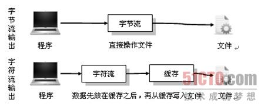
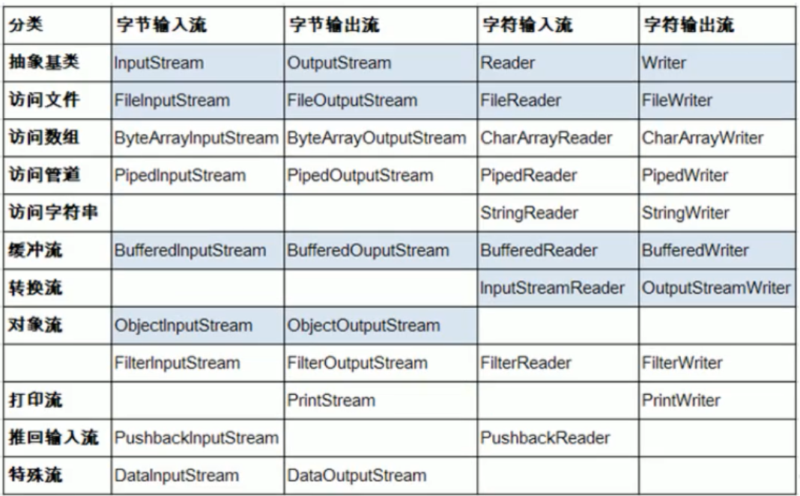

## 泛型

#### 设计背景

+   泛型提供了编译时类型安全检测机制，`泛型的本质是类型参数化`，解决不确定类型对象的问题。
+   在JDK1.5之前，利用`Object`和强制转换来实现这样的功能，但是这种情况下管理的元素是不确定的，编译器可能不提示错误，在运行的时候才出现异常；而泛型则是在编译时保证数据安全。


#### 类型擦除

+   一个简单的例子

```java
public class App {
    public static void main(String[] args) {
        User<Integer> user = new User<>(10);
        Integer age = user.getAge();
        System.out.println(age);
    }
}

class User<T> {
    T age;
    public User(T age) {
        this.age = age;
    }

    public T getAge() {
        return this.age;
    }
}
```

+   对User类进行反编译

    ```c
    Compiled from "App.java"
    class day09.User<T> {
      T age;
    
      public day09.User(T);
        Code:
           0: aload_0
           1: invokespecial #1                  // Method java/lang/Object."<init>":()V
           4: aload_0
           5: aload_1
           6: putfield      #2                  // Field age:Ljava/lang/Object;
           9: return
    
      public T getAge();
        Code:
           0: aload_0
           1: getfield      #2                  // Field age:Ljava/lang/Object;
           4: areturn
    }
    
    ```

    可以发现，在编译之后，`<T>` 类型变成了`Object`，这被称为类型擦除。换而言之，泛型就是在编译期间增加了一道检查而已，目的是促使程序员更加安全地使用泛型。

    在泛型类被类型擦除的时候，之前泛型类中的类型参数如果**没有指定上限**，如`<T>`则会被转成普通的**Object类型**，如果指定了上限如`<T extends String>`，则类型参数就会被替换成类型上限。


#### 泛型使用

对于泛型类和泛型和接口而言，尖括号的泛型放置在类名或者接口名后 `class A <T> {}`；而对于泛型方法而言，如果未定义泛型类，需要在返回类型上定义尖括号的泛型`public <T> T func(T age);`

+   泛型类

```JAVA
class User <T,E> {
    private T name;
    private E age;

    User(T name, E age) {
        this.name = name;
        this.age = age;
    }

    @Override
    public String toString() {
        return "User{" +
                "name=" + name +
                ", age=" + age +
                '}';
    }
}
```

+   泛型接口

```java
interface Fuckable<T> {
    public T next();
}

class Man implements Fuckable<Integer> {
    @Override
    public Integer next() {
        return 12;
    }
}

// 或者
class Man<T> implements Fuckable<T> {
    private T next_val;
    @Override
    public T next() {
        return next_val;
    }
}
```

+   泛型方法

````java
// 返回T类型的值
public static <T> T getName(T name) {
	return name;
}

// 不反悔值
public static <T> getName(T name) {

}
````

+   泛型创建数组

```java
T [] arr = (T[]) new Object[10];
```


#### 泛型通配符

+   简单使用

```java
List<Integer> l1 = new ArrayList<>();
List<String> l2 = new ArrayList<>();
List<?> p = new ArrayList<>(); // 注意不能向其内部添加数据，除了null
p = l1;
p = l2;
```

+   有限制条件的通配符

```java
List<? extends Person> list1 = null; // 泛型限制为Person及其子类，相当于小于等于，上界通配符
List<? super Person> list1 = null; // 泛型限制为Person及其父类，相当于大于等于，下界通配符
```

​	举例：

```java
List<ArrayList>  l1 = new ArrayList<>();
List<? extends List>  l = new ArrayList<>();
l = l1; // 正确

List<ArrayList>  l1 = new ArrayList<>();
List<? super List>  l = new ArrayList<>();
l = l1; // 错误
```

#### 泛型的好处

```java
public class App <T> {
    private T t;
    public void set(T t) {this.t = t;}

    public T getT() {  return t;  }

    public void noSpecifyType() {
        App app = new App();
        app.set("test");
        // 需要强制类型转换
        String t = (String )app.getT();
        System.out.println(t);
    }

    public void SpecifyType() {
        App<String> app = new App<String>();
        app.set("test");
        // 不需要强制类型转换
        String t = app.getT();
        System.out.println(t);
    }
}
```

#### `<T>` 和 `<?>` 的区别

`<T>` 是一个 确定的 类型，通常用于泛型类和泛型方法的定义，`<?>`是一个 不确定 的类型，通常用于泛型方法的调用代码和形参，不能用于定义类和泛型方法。


#### 类型擦除带来的问题

Java 中的泛型和 C++ 中的模板有一个很大的不同：

-   C++ 中模板的实例化会为每一种类型都产生一套不同的代码，这就是所谓的代码膨胀。
-   Java 中并不会产生这个问题。虚拟机中并没有泛型类型对象，所有的对象都是普通类。[摘自](https://juejin.cn/post/6844903456533135368#%E6%B3%9B%E5%9E%8B%E7%9A%84%E4%BD%BF%E7%94%A8%E5%9C%BA%E6%99%AF)

当编译器对带有泛型的java代码进行编译时，它会去执行**类型检查**和**类型推断**，然后生成普通的不带泛型的字节码，这种普通的字节码可以被一般的 Java 虚拟机接收并执行，这在就叫做 **类型擦除（type erasure）**。

泛型擦除是因为泛型的支持是在JDK1.5之后，那么运行时JVM是不能识别泛型的，所以有了一个擦除机制，擦除之后，`类型信息转为它的边界类型`。这会带来两个问题：

+   继承中方法的重载问题（编译器会生成一个桥方法解决）
+   类型擦除之后，如何获取信息的问题（类型信息擦除后，原始信息仍然保留在类型的常量池中）


JVM泛型的擦除机制，在运行时JVM是不知道泛型信息的，所以可以给oa[1]赋上一个ArrayList而不会出现异常，但是在取出数据的时候却要做一次类型转换，所以就会出现ClassCastException，如果可以进行泛型数组的声明，上面说的这种情况在编译期将不会出现任何的警告和错误，只有在运行时才会出错。

而对泛型数组的声明进行限制，对于这样的情况，可以在编译期提示代码有类型安全问题，比没有任何提示要强很多。
[原文链接](https://blog.csdn.net/s10461/article/details/53941091)


#### PECS 规则

>   为了获得最大限度的灵活性，要在表示 生产者或者消费者 的输入参数上使用通配符，使用的规则就是：生产者有上限、消费者有下限：
>
>   PECS: producer-extends, costumer-super

## IO流


字节（Byte）流不会用到缓冲区；

字符（Unicode）流用到了缓冲区。[🔗](https://blog.csdn.net/qq_35122713/article/details/88793019)



#### File类

+   构造File对象

    ```java
    // 内存层面的调用，不要求在磁盘中存在
    File f1 = new File("E:\\git\\pure_java\\jdbc.properties");
    System.out.println(f1.getAbsolutePath());
    System.out.println(f1.getPath());
    System.out.println(f1.getParent());
    
    // 列出所有文件
    File f1 = new File("E:\\git\\pure_java");
    System.out.println(Arrays.toString(f1.listFiles()));
    ```

+   File常用判断功能

    ```java
    File f1 = new File("E:\\git\\pure_java\\jdbc.properties");
    System.out.println(f1.isFile());
    System.out.println(f1.isDirectory());
    System.out.println(f1.exists());
    System.out.println(f1.canRead());
    System.out.println(f1.canWrite());
    System.out.println(f1.isHidden());
    ```

+   File的创建和删除

    ```java
    // 文件
    File f1 = new File("E:\\git\\pure_java\\jdbc.properties");
    if(!f1.exists()) {
        f1.createNewFile();
        System.out.println("创建成功");
    } else {
        f1.delete();
        System.out.println("删除成功");
    }
    
    // 文件夹
    File f1 = new File("E:\\git\\pure_java\\jdbc");
    if(!f1.exists()) {
        f1.mkdir(); // 如果上层文件不存在，则停止创建文件
        // f1.mkdirs(); // 如果上层文件不存在，则帮助创建文件
        
        System.out.println("创建成功");
    } else {
        f1.delete(); // 要想删除成功，jdbc文件夹下是不能有文件存在的
        System.out.println("删除成功");
    }
    ```

+   File在当前目录下创建另一个文件

```java
File f1 = new File("D:://a/b/c.txt");
File f2 = new File(f1.getParent(),"d.txt");
```


#### 流的分类

|        |    字节流    | 字符流 |
| :----: | :----------: | :----: |
| 输入流 | InputStream  | Reader |
| 输出流 | OutputStream | Writer |





## IO模型

#### 概念说明

+   **进程切换**：为了控制进程的执行，内核必须有能力挂起正在CPU上运行的进程，并恢复以前挂起的某个进程，这个过程称为进程切换。
    +   保存处理机上下文，包括程序计数器和其他寄存器。
    +   更新PCB信息。
    +   把进程的PCB移入相应的队列，如就绪、在某事件阻塞等队列。
    +   选择另一个进程执行，并更新其PCB。
    +   更新内存管理的数据结构。
    +   恢复处理机上下文。
+   文件描述符：是计算机科学中的一个术语，是一个用于表述指向文件的引用的抽象化概念。
    +   文件描述符在形式上是一个非负整数。实际上，它是一个索引值，指向内核为每一个进程所维护的该进程打开文件的记录表。当程序打开一个现有文件或者创建一个新文件时，内核向进程返回一个文件描述符。在程序设计中，一些涉及底层的程序编写往往会围绕着文件描述符展开。但是文件描述符这一概念往往只适用于UNIX、Linux这样的操作系统。


#### IO模式


+   IO访问：1 数据会先被拷贝到操作系统内核的缓冲区中 2 数据从缓冲区拷贝到应用程序的地址空间
+   SOCKET流：1 等待网络上的数据分组道道，然后复制到内核的某个缓冲区 2 数据从**内核缓冲区**复制到**应用进程缓冲区**


#### IO多路复用模型 [🔗](https://www.cnblogs.com/Anker/p/3265058.html) [🔗](https://www.bilibili.com/video/BV1qJ411w7du?from=search&seid=4380407149268177732)

+   select

    +   阻塞函数
    +   将文件描述符从用户态拷贝到内核态
    +   缺点
        +   每次调用select，都需要将fd集合从用户态拷贝到内核态
        +   select支持的文件描述符数量太小了，默认是1024
        +   每次调用select都需要在内核遍历传递进来的所有fd
    +   优点
        +   让内核态监听文件描述符
        +   可以同时监听多个文件描述符

+   poll

    +   阻塞函数

    +   将文件描述符从用户态拷贝到内核态

    +   引入pollfd结构体

        ```c
        struct pollfd {
            int fd;
            short events; // 所关注的事件，POLLIN或者POLLOUT
            short revents; // 对event的一个反馈，表明是否有数据
        }
        ```

    +   解决缺点

        +   pollfd的revents解决了文件描述符的大小限制
        +   pollfds可以重用
        +   其他没有解决

+   epoll
    +   新引入了三个函数：`epoll_create`，`epoll_ctl`，`epoll_wait`
    +   epoll的解决方案在epoll_ctl函数中。每次注册新的事件到epoll句柄中时（在epoll_ctl中指定EPOLL_CTL_ADD），会把所有的fd拷贝进内核，而不是在epoll_wait的时候重复拷贝。epoll保证了每个fd在整个过程中只会拷贝一次。
    +   返回已经读取到数据的文件描述符的数量，然后对事件进行重排，将有数据的事件放到前面，然后进行遍历
    +   解决问题
        +   文件描述符的拷贝开销
        +   将O(n)的事件复杂度降低到O(1)

+   代码 [🔗](https://devarea.com/linux-io-multiplexing-select-vs-poll-vs-epoll/#.XYD0TygzaUl)

    +   select

        ```java
          for (i=0;i<5;i++) // 文件描述符准备
          {
            memset(&client, 0, sizeof (client));
            addrlen = sizeof(client);
            fds[i] = accept(sockfd,(struct sockaddr*)&client, &addrlen);
            if(fds[i] > max)
            	max = fds[i];
          }
          
          while(1){ // 轮询
        	FD_ZERO(&rset);
          	for (i = 0; i< 5; i++ ) {
          		FD_SET(fds[i],&rset);
          	}
         
           	puts("round again");
            // 缺点：在轮询的过程中，每次都需要将rset从用户态拷贝到内核态
        	select(max+1, &rset, NULL, NULL, NULL); // 缺点：rset一个bitmap，1024长，用来表示文件描述符的状态
         
        	for(i=0;i<5;i++) { // 缺点：需要花费O(n)的时间遍历
        		if (FD_ISSET(fds[i], &rset)){
        			memset(buffer,0,MAXBUF);
        			read(fds[i], buffer, MAXBUF);
        			puts(buffer);
        		}
        	}	
          }
        ```

    +   poll

    ```c
      struct pollfd {
        int fd;
        short events; 
        short revents;
      };
    
      for (i=0;i<5;i++) 
      {
        memset(&client, 0, sizeof (client));
        addrlen = sizeof(client);
        pollfds[i].fd = accept(sockfd,(struct sockaddr*)&client, &addrlen);
        pollfds[i].events = POLLIN;
      }
      sleep(1);
      while(1){
      	puts("round again");
        // 缺点：在轮询的过程中，每次都需要将rset从用户态拷贝到内核态
    	poll(pollfds, 5, 50000); // 改进，利用pollfds而不是rset，可以极大地扩充文件描述符地数量
     
    	for(i=0;i<5;i++) { // 缺点：仍然需要O(n)遍历
    		if (pollfds[i].revents & POLLIN){
    			pollfds[i].revents = 0;
    			memset(buffer,0,MAXBUF);
    			read(pollfds[i].fd, buffer, MAXBUF);
    			puts(buffer);
    		}
    	}
      }
    ```

    +   epoll

        ```c
          struct epoll_event events[5];
          int epfd = epoll_create(10);
          ...
          ...
          for (i=0;i<5;i++) 
          {
            static struct epoll_event ev;
            memset(&client, 0, sizeof (client));
            addrlen = sizeof(client);
            ev.data.fd = accept(sockfd,(struct sockaddr*)&client, &addrlen);
            ev.events = EPOLLIN;
            epoll_ctl(epfd, EPOLL_CTL_ADD, ev.data.fd, &ev); // 改进，EPOLL_CTL_ADD将fd拷贝到内核中，而不是在轮询中重复拷贝
          }
          
          while(1){
          	puts("round again");
          	nfds = epoll_wait(epfd, events, 5, 10000); // 改进，nfds，得到已经有数据地时间数量，并在内部进行重排
        	
        	for(i=0;i<nfds;i++) { 
        			memset(buffer,0,MAXBUF);
        			read(events[i].data.fd, buffer, MAXBUF);
        			puts(buffer);
        	}
          }
        ```

        

## TCP IP 通信

#### 学习背景

+   TCP / IP 高并发负载均衡，集群
+   IO模型 **内核给程序暴露api源自socket**
    +   NIO，BIO，多路复用器，select/epoll/poll
    +   文件IO
    +   网络IO
+   分布式，微服务，服务网络，云计算

#### TCP/IP 应用层协议

