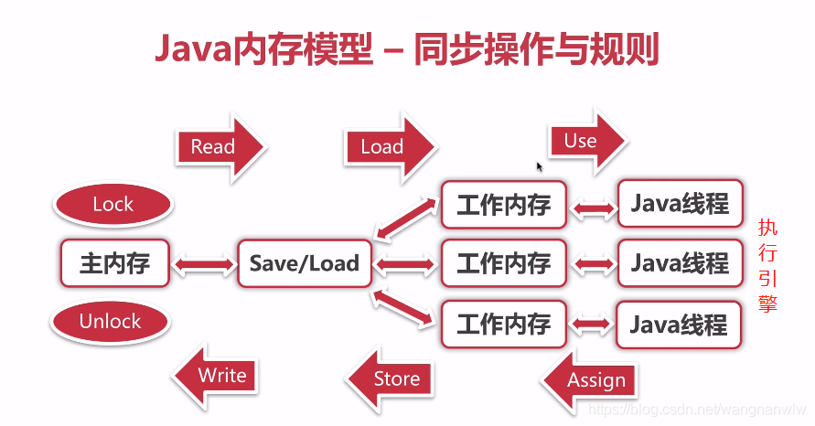

并发编程：

+   线程池
+   原子操作
+   并发工具类（闭锁）
    +   CyclicBarrier
    +   CountDownLatch
+   锁
    +   Synchronized
    +   可重入锁
+   并发数据结构
+   线程间通信
+   内存模型

+   其他
    +   ThreadLocal
    +   Fork/join

## Java内存模型

#### 1. Java内存模型 ~ 八种基本数据操作

+   lock(锁定):作用于主内存的变量,把一个变量标识为一条线程独占状态
+   unlock(解锁):作用于主内存的变量,把一个处于锁定状态的变量释放出来 , 释放后的变量才可以被其他线程锁定unlock(解锁):作用于主内存的变量,把一个处于锁定状态的变量释放出来 , 释放后的变量才可以被其他线程锁定
+   read(读取) : 作用于主内存的变量 , 把一个变量值从主内存传输到线程的工作内存中,以便随后的load动作使用read(读取) : 作用于主内存的变量 , 把一个变量值从主内存传输到线程的工作内存中,以便随后的load动作使用
+   load(载入)：作用域工作内存的变量，它把read操作从主内存中得到的变量值放入工作内存的变量副本中load(载入)：作用域工作内存的变量，它把read操作从主内存中得到的变量值放入工作内存的变量副本中
+   use (使用) : 作用于工作内存的变量 , 把工作内存中的一个变量值传递给执行引擎use (使用) : 作用于工作内存的变量 , 把工作内存中的一个变量值传递给执行引擎
+   assign(赋值):作用于工作内存的变量,它把一个从执行引擎接收到的值赋值给工作内存的变量
+   store (存储) : 作用于工作内存的变量 , 把工作内存中的一个变量的值传送到主内存中 , 以便随后的write的操作
+   write (写入) : 作用于主内存的变量, 它把store操作从工作内存中一个变量的值传送到主内存的变量中

#### 2.内存模型 - MESI缓存一致性协议

多个CPU从主内存中读取同一个数据到各自的高速缓存，当其中某个CPU修改了缓存里的数据，该数据会马上同步到主内存，其他CPU通过总线嗅探机制可以感知到数据变化，从而将自己缓存里的数据失效，然后重新从主内存中读取数据。

#### 3. 内存模型 - Happens-before

**如果一个操作happens-before另一个操作，那么第一个操作的执行结果将对第二个操作可见，而且第一个操作的执行顺序排在第二个操作之前。**

+   **`程序次序规则`**：一个线程内，按照代码顺序，书写在前面的操作先行发生于书写在后面的操作；
+   **`管程锁定规则`：**就是无论是在单线程环境还是多线程环境，对于同一个锁来说，一个线程对这个锁解锁之后，另一个线程获取了这个锁都能看到前一个线程的操作结果！(管程是一种通用的同步原语，synchronized就是管程的实现）；
+   **`volatile变量规则`：**就是如果一个线程先去写一个volatile变量，然后一个线程去读这个变量，那么这个写操作的结果一定对读的这个线程可见。
+   **`线程启动规则`：**在主线程A执行过程中，启动子线程B，那么线程A在启动子线程B之前对共享变量的修改结果对线程B可见。
+   **`线程终止规则`：**在主线程A执行过程中，子线程B终止，那么线程B在终止之前对共享变量的修改结果在线程A中可见。也称线程join()规则
+   **`线程中断规则`**：对线程interrupt()方法的调用先行发生于被中断线程代码检测到中断事件的发生，可以通过Thread.interrupted()检测到是否发生中断。
+   **`传递性规则`：**这个简单的，就是happens-before原则具有传递性，即hb(A, B) ， hb(B, C)，那么hb(A, C)。
+   **`对象终结规则`：**这个也简单的，就是一个对象的初始化的完成，也就是构造函数执行的结束一定 happens-before它的finalize()方法
