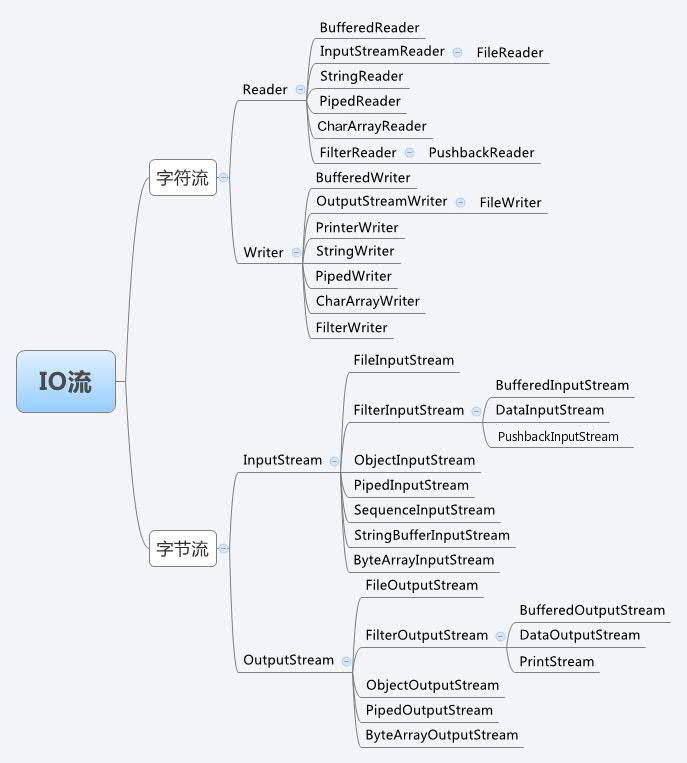
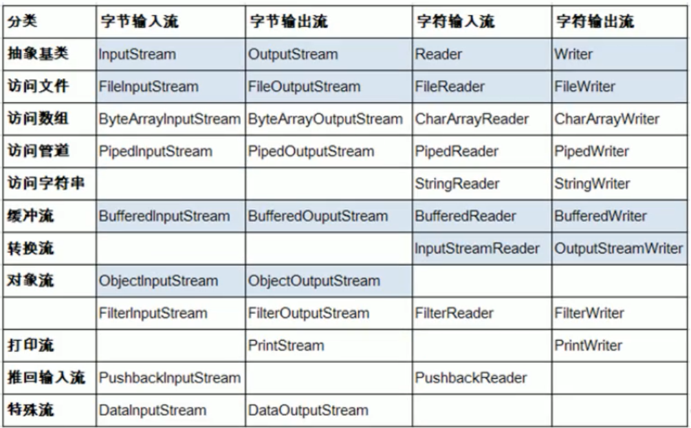

## IO流




#### File类

+ 构造File对象

    ```java
    // 内存层面的调用，不要求在磁盘中存在
    File f1 = new File("E:\\git\\pure_java\\jdbc.properties");
    System.out.println(f1.getAbsolutePath());
    System.out.println(f1.getPath());
    System.out.println(f1.getParent());
    
    // 列出所有文件
    File f1 = new File("E:\\git\\pure_java");
    System.out.println(Arrays.toString(f1.listFiles()));
    ```

+ File常用判断功能

    ```java
    File f1 = new File("E:\\git\\pure_java\\jdbc.properties");
    System.out.println(f1.isFile());
    System.out.println(f1.isDirectory());
    System.out.println(f1.exists());
    System.out.println(f1.canRead());
    System.out.println(f1.canWrite());
    System.out.println(f1.isHidden());
    ```

+ File的创建和删除

    ```java
    // 文件
    File f1 = new File("E:\\git\\pure_java\\jdbc.properties");
    if(!f1.exists()) {
        f1.createNewFile();
        System.out.println("创建成功");
    } else {
        f1.delete();
        System.out.println("删除成功");
    }
    
    // 文件夹
    File f1 = new File("E:\\git\\pure_java\\jdbc");
    if(!f1.exists()) {
        f1.mkdir(); // 如果上层文件不存在，则停止创建文件
        // f1.mkdirs(); // 如果上层文件不存在，则帮助创建文件
        
        System.out.println("创建成功");
    } else {
        f1.delete(); // 要想删除成功，jdbc文件夹下是不能有文件存在的
        System.out.println("删除成功");
    }
    ```

+ File在当前目录下创建另一个文件

```java
File f1 = new File("D:://a/b/c.txt");

File f2 = new File(f1.getParent(),"d.txt");
```


#### 流的分类

|        |    字节流    | 字符流 |
| :----: | :----------: | :----: |
| 输入流 | InputStream  | Reader |
| 输出流 | OutputStream | Writer |


## 


## IO模型

#### 概念说明

+   **进程切换**：为了控制进程的执行，内核必须有能力挂起正在CPU上运行的进程，并恢复以前挂起的某个进程，这个过程称为进程切换。
    +   保存处理机上下文，包括程序计数器和其他寄存器。
    +   更新PCB信息。
    +   把进程的PCB移入相应的队列，如就绪、在某事件阻塞等队列。
    +   选择另一个进程执行，并更新其PCB。
    +   更新内存管理的数据结构。
    +   恢复处理机上下文。
+   文件描述符：是计算机科学中的一个术语，是一个用于表述指向文件的引用的抽象化概念。
    +   文件描述符在形式上是一个非负整数。实际上，它是一个索引值，指向内核为每一个进程所维护的该进程打开文件的记录表。当程序打开一个现有文件或者创建一个新文件时，内核向进程返回一个文件描述符。在程序设计中，一些涉及底层的程序编写往往会围绕着文件描述符展开。但是文件描述符这一概念往往只适用于UNIX、Linux这样的操作系统。


#### IO模式


+   IO访问：1 数据会先被拷贝到操作系统内核的缓冲区中 2 数据从缓冲区拷贝到应用程序的地址空间
+   SOCKET流：1 等待网络上的数据分组道道，然后复制到内核的某个缓冲区 2 数据从**内核缓冲区**复制到**应用进程缓冲区**


#### 阻塞IO模型的逻辑

在用户线程发起IO请求之后，内核会检查数据是否准备好，此时用户线程处于阻塞状态；

在内存数据准备好之后，内核将数据复制到用户线程中。


#### 非阻塞IO模型

在用户线程发起IO请求之后，会立即从内核得到一个结果，如果为true表示数据准备好了，否者表示数据没有准备好，用户线程稍后再次发起请求，。


#### IO多路复用模型 [🔗](https://www.cnblogs.com/Anker/p/3265058.html) [🔗](https://www.bilibili.com/video/BV1qJ411w7du?from=search&seid=4380407149268177732)

+ select

    +   阻塞函数
    +   将文件描述符从用户态拷贝到内核态
    +   缺点
        +   每次调用select，都需要将fd集合从用户态拷贝到内核态
        +   select支持的文件描述符数量太小了，默认是1024
        +   每次调用select都需要在内核遍历传递进来的所有fd
    +   优点
        +   让内核态监听文件描述符
        +   可以同时监听多个文件描述符

+ poll

    + 阻塞函数

    + 将文件描述符从用户态拷贝到内核态

    + 引入pollfd结构体

        ```c
        struct pollfd {
            int fd;
            short events; // 所关注的事件，POLLIN或者POLLOUT
            short revents; // 对event的一个反馈，表明是否有数据
        }
        ```

    + 解决缺点

        +   pollfd的revents解决了文件描述符的大小限制
        +   pollfds可以重用
        +   其他没有解决

+ epoll

    +   新引入了三个函数：`epoll_create`，`epoll_ctl`，`epoll_wait`
    +   epoll的解决方案在epoll_ctl函数中。每次注册新的事件到epoll句柄中时（在epoll_ctl中指定EPOLL_CTL_ADD），会把所有的fd拷贝进内核，而不是在epoll_wait的时候重复拷贝。epoll保证了每个fd在整个过程中只会拷贝一次。
    +   返回已经读取到数据的文件描述符的数量，然后对事件进行重排，将有数据的事件放到前面，然后进行遍历
    +   解决问题
        +   文件描述符的拷贝开销
        +   将O(n)的事件复杂度降低到O(1)

+ 代码 [🔗](https://devarea.com/linux-io-multiplexing-select-vs-poll-vs-epoll/#.XYD0TygzaUl)

    + select

        ```java
          for (i=0;i<5;i++) // 文件描述符准备
          {
            memset(&client, 0, sizeof (client));
            addrlen = sizeof(client);
            fds[i] = accept(sockfd,(struct sockaddr*)&client, &addrlen);
            if(fds[i] > max)
            	max = fds[i];
          }
          
          while(1){ // 轮询
        	FD_ZERO(&rset);
          	for (i = 0; i< 5; i++ ) {
          		FD_SET(fds[i],&rset);
          	}
         
           	puts("round again");
            // 缺点：在轮询的过程中，每次都需要将rset从用户态拷贝到内核态
        	select(max+1, &rset, NULL, NULL, NULL); // 缺点：rset一个bitmap，1024长，用来表示文件描述符的状态
         
        	for(i=0;i<5;i++) { // 缺点：需要花费O(n)的时间遍历
        		if (FD_ISSET(fds[i], &rset)){
        			memset(buffer,0,MAXBUF);
        			read(fds[i], buffer, MAXBUF);
        			puts(buffer);
        		}
        	}	
          }
        ```

    + poll

    ```c
      struct pollfd {
        int fd;
        short events; 
        short revents;
      };
    
      for (i=0;i<5;i++) 
      {
        memset(&client, 0, sizeof (client));
        addrlen = sizeof(client);
        pollfds[i].fd = accept(sockfd,(struct sockaddr*)&client, &addrlen);
        pollfds[i].events = POLLIN;
      }
      sleep(1);
      while(1){
      	puts("round again");
        // 缺点：在轮询的过程中，每次都需要将rset从用户态拷贝到内核态
    	poll(pollfds, 5, 50000); // 改进，利用pollfds而不是rset，可以极大地扩充文件描述符地数量
     
    	for(i=0;i<5;i++) { // 缺点：仍然需要O(n)遍历
    		if (pollfds[i].revents & POLLIN){
    			pollfds[i].revents = 0;
    			memset(buffer,0,MAXBUF);
    			read(pollfds[i].fd, buffer, MAXBUF);
    			puts(buffer);
    		}
    	}
      }
    ```

    + epoll

        ```c
          struct epoll_event events[5];
          int epfd = epoll_create(10);
          ...
          ...
          for (i=0;i<5;i++) 
          {
            static struct epoll_event ev;
            memset(&client, 0, sizeof (client));
            addrlen = sizeof(client);
            ev.data.fd = accept(sockfd,(struct sockaddr*)&client, &addrlen);
            ev.events = EPOLLIN;
            epoll_ctl(epfd, EPOLL_CTL_ADD, ev.data.fd, &ev); // 改进，EPOLL_CTL_ADD将fd拷贝到内核中，而不是在轮询中重复拷贝
          }
          
          while(1){
          	puts("round again");
          	nfds = epoll_wait(epfd, events, 5, 10000); // 改进，nfds，得到已经有数据地时间数量，并在内部进行重排
        	
        	for(i=0;i<nfds;i++) { 
        			memset(buffer,0,MAXBUF);
        			read(events[i].data.fd, buffer, MAXBUF);
        			puts(buffer);
        	}
          }
        ```


##  BIO / NIO / AIO

#### BIO

客户端每来一个请求，服务器端都需要建立创建一个线程。


#### NIO

new IO 或者应该成为 non-block IO。

提供了Channel，Selector和Buffer三个组件。

> Buffer

在NIO厍中，所有数据都是用缓冲区处理的。在读取数据时，它是直接读到缓冲区中的; 在写入数据时，写入到缓冲区中。任何时候访问NIO中的数据，都是通过缓冲区进行操作。

> Channel

NIO 通过Channel（通道） 进行读写。

> Selector

选择器用于使用单个线程处理多个通道。因此，它需要较少的线程来处理这些通道。线程之间的切换对于操作系统来说是昂贵的。 因此，为了提高系统效率选择器是有用的


#### AIO

Asynchronous I/O，它是异步非阻塞的IO模型。


#### 水平触发与边缘触发

**Level_triggered(水平触发)**：当被监控的文件描述符上有可读写事件发生时，epoll_wait()`会不断通知处理程序去读写`。如果这次没有把数据一次性全部读写完(如读写缓冲区太小)，那么下次调用 epoll_wait()时，它还会通知你在上没读写完的文件描述符上继续读写，当然如果你一直不去读写，它会一直通知你。如果系统中有大量你不需要读写的就绪文件描述符，而它们每次都会返回，这样会大大降低处理程序检索自己关心的就绪文件描述符的效率。

**Edge_triggered(边缘触发)**：当被监控的文件描述符上有可读写事件发生时，epoll_wait()会通知处理程序去读写。如果这次没有把数据全部读写完(如读写缓冲区太小)，那么下次调用epoll_wait()时，它不会通知你，也就是它只会通知你一次，直到该文件描述符上出现第二次可读写事件才会通知你。这种模式比水平触发效率高，系统不会充斥大量你不关心的就绪文件描述符。

**水平触发(level-triggered，也被称为条件触发)LT:** 只要满足条件，就触发一个事件(只要有数据没有被获取，内核就不断通知你)
**边缘触发(edge-triggered)ET:** 每当状态变化时，才会触发一个事件。

作者：我要出去乱说
链接：https://www.nowcoder.com/discuss/686842?type=post&order=time&pos=&page=1&ncTraceId=&channel=-1&source_id=search_post_nctrack&subType=2
来源：牛客网


#### 1、EPOLL的水平模式和边沿模式有何区别？

>   因为自我介绍时，[项目]()中用了EPOLL，所以问了这个，我按照常规思路答了。

#### 2、ET和LT模式各自应用场景是什么？为什么有了高效的ET还需要LT？

>   这个问题没准备过，被问傻了，后来查了下：
>
>   -   LT的编程更符合用户直觉，业务层逻辑更简单，不易出错，但效率较低； 
>   -   ET的编程可以做到更加简洁，某些场景下更加高效，但另一方面容易遗漏事件，容易产生bug； 
>   -   对于nginx这种高性能服务器，ET模式是很好的，Redis使用的是LT，避免使用的过程中出现bug； 
>   -   当并发量比较小时，比较推荐LT，因为LT模式下应用的读写逻辑比较简单，不容易遗漏事件，代码不易出错好维护，而且性能损失不大。当并发量非常大时，推荐使用ET模式，可以有效提升EPOLL效率。

**应用场景：**

+   关于读事件，如果业务可以保证每次都可以读完，那就可以使用ET，否则使用LT。
+   对于写事件，如果一次性可以写完那就可以使用LT，写完删除写事件就可以了；但是如果写的**数据很大**也不在意延迟，那么就可以使用ET，因为ET可以保证在发送缓冲区变为空时才再次通知（而LT则是发送缓冲区空了就可以通知就绪，这样就每次触发就只能写一点点数据，内核切换开销以及内存拷贝开销过大）

这两种触发的区别与epoll的实现机理有关。

在ET模式下，每次调用epoll_wait方法的时候，系统会直接将就绪链表清空，这样只有新就绪的fd才会被插入就绪链表并返回。

在LT模式下，每次调用epoll_wait方法时，系统只将就绪链表中的**事件已经被处理完毕的fd**（socket关联的kernel缓冲区数据已经被读取完毕）移除，如果某个fd上还有未被处理的数据，它会被保留在就绪链表中，并在epoll_wait返回时放在events参数中回送给用户。

ps. Java的nio就是用的水平触发。

