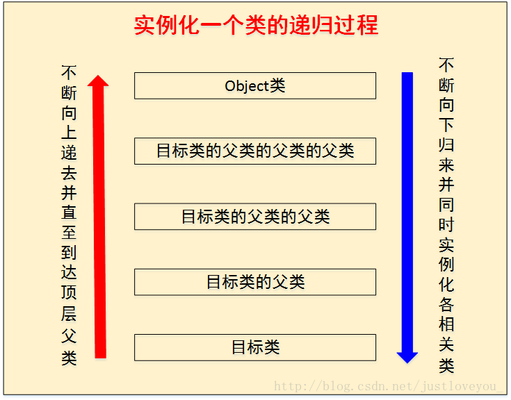
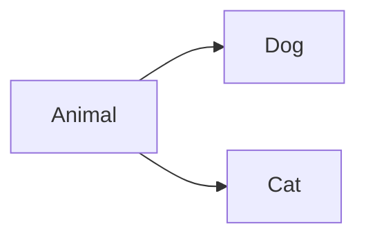

##  1. 实例化过程

在实例化的过程中采用递归的方式进行一个类对象的实例化。




## 2. 继承

#### 继承性的格式

A：子类、派生类、subclass

B：父类、超类、基类、superclass

一旦子类A继承父亲B以后，子类A就获取了父类B中声明的结构、属性、方法。


#### Java关于继承性的规定

java支持单继承和多层继承，不允许多继承。除此之外，`java.lang.Object`类是所有类的基类。


## 3. 方法的重写

#### 定义

子类继承父类之后，可以继承父类的方法和属性和方法。

在子类中可以根据需要对父类中继承来的方法进行改造，也称为方法的重写。


#### 应用

重写之后，当创建子类对象之后，通过子类对象调用同名同参数的方法时，实际执行的是子类重写父类的方法。

#### 重写的规定

有三条规则：

+   方法名&形参列表相同，也就是函数的签名
+   权限修饰符
+   返回值
+   抛出的异常

子类重写的方法名和形参列表与父类被重写的方法相同。

子类重写的方法的权限修饰符不小于父类被重写的方法的权限修饰符。


## 4. 多态的属性

#### 对象的多态性

父类的引用指向子类的对象，多态是运行时行为（也成为动态绑定），只有运行之后才知道运行的结果。

```java
Person p1 = new Man();
p1.eat(); // 会调用Man类中的重写的方法
```

#### 多态的使用：虚拟方法调用

在编译期：只能调用父类中声明的方法，但在运行期，我们实际执行的是子类重写父类的方法，这也是CGLib能偶实现动态代理的原理。

总结 ：编译时，看左边（也就是父类有的那些方法）；运行时，看右边（也就是子类实际重写的方法）

#### 多态使用的前提 （必须继承&必须重写）

1.  类的继承关系，一个类必须继承另一个类
2.  方法的重写，子类必须重写父类的方法

#### 多态性使用例子

```java
public class AnimalTest {
    public static void main(String args[]) {
        AnimalTest at = new AnimalTest();
        at.func(new Dog());
        at.func(new Cat());
    }
    public void func(Animal animal) {
        animal.eat();
        animal.bark();
    }
}

class Animal {
    public void eat() {}
    public void bark() {}
}

class Dog extends Animal {
    public void eat() {
        System.out.println("狗吃狗粮");
    }
    public void bark() {
        System.out.println("汪汪汪！");
    }
}

class Cat extends Animal {
    public void eat() {
        System.out.println("猫吃鱼");
    }
    public void bark() {
        System.out.println("喵喵喵！");
    }
}
```

#### 对象的多态性

对象的多态性只适用于方法，不适用于属性。

```java
// 就比如现在父类和子类都有一个属性age，如果我们定义了
Person p1 = new Man();
// 那我们调用p1.age实际访问的是Person的age
```

#### 重载和重写

对于重载而言，在方法调用之前，编译器就已经确定了所要调用的方法，称为**早绑定**或者**静态绑定**。 

对于重写而言，只有等到方法被调用，编译器才会确定索要调用的具体方法，称为**晚绑定**或者**动态绑定**。

#### instance-of

```java
Animal a = new Dog(); // 向上转型，多态
Dog d = (Dog)a; // 向下转型，强制转换
```

在进行类型转换的时候，有可能出现强制转换失败，假设现在的类继承图如下：



一个简单的例子：

```java
public void func(Animal a) {
    if (a instanceof Dog) {
        a = (Dog) a;
        a.eatshit(); // 狗所独有的特性
    } else if (a instanceof Cat) {
        a = (Cat) a;
        a.climb();  // 猫所独有的特性
    }
}
// 主要的目的是为了防止在强制类型转化过程中可能出现的问题
```


## 5. object 类的使用

#### Object是所有类的父类

所有类的基类都是Object类

#### Object类的成员

属性：无

方法：

+   eauqls
+   toString
+   getClass 反射
+   hashCode集合
+   clone
+   finalize
+   wait
+   notify
+   notifyAll

#### equals

在比较equals和==符号时，大家总喜欢举字符串的例子，但是实际上自己自定义的类只要重写equals方法也能够实现相同的效果。

```java
class Order {
    int x;
    @Override
    public boolean equals(Object o) {
        if (this == o) return true;
        if (o == null || this.getClass() != o.getClass()) return false;
        Order order = (Order) o;
        return x == order.x;
    }
}
```

如果不重写equals，那么直接调用了object类中的equals

```java
public boolean equals(Object obj) {
    return (this == obj);
}
```


#### toString

```java
public String toString() {
    return getClass().getName() + "@" + Integer.toHexString(hashCode());
}
```


+   当我们输出一个对象的引用时，实际调用当前对象的`toString`。

+   而对于String，Date，File、包装类等都重写了Object类中的toString方法。


#### 深拷贝和浅拷贝

浅拷贝就是值复制了引用地址，但是在堆空间中存放的仍然是同一份内容。 如果需要进行深拷贝，则需要堆clone方法进行重写，并进行递归复制。


## 6. 包装类

#### 基本的对应关系

| 序号 | 基本数据类型 |  包装类   |    数据范围    |
| :--: | :----------: | :-------: | :------------: |
|  1   |     byte     |   Byte    |  -128~127 8位  |
|  2   |  **short**   |   Short   | 16位 两个字节  |
|  3   |     int      |  Integer  | 32位 四个字节  |
|  4   |     long     |   Long    | 64位 八个字节  |
|  5   |     char     | Character | 16 位 两个字节 |
|  6   |    float     |   Float   | 32位  四个字节 |
|  7   |    double    |  Double   | 64位 八个字节  |
|  8   |   boolean    |  Boolean  |      一位      |


#### 基本数据类型，包装类，String类间的转换


#### 为什么需要包装类型

Java的设计理念是一切皆为对象，很多时候需要以对象的形式操作，比如 `hashCode()` 获取哈希值，包装类的存在解决了基本数据类型无法做到的事情：`泛型类型参数`、`序列化`、`类型转换`、`高频区间数据缓存`。

#### 高频数据缓存

这个特性是包装类很重要的用途之一，用于高频区间的数据缓存。以Integer为例来说，在数值区间为-128~127时，会直接复用已有对象。在这区间之外的数字才会在堆上产生。

+   Byte 表示范围 `-128~127`，全部缓存。
+   Short表示范围 `-32768-32767`，缓存范围 `-128~127`。
+   Character，缓存范围`0~127`
+   Long，缓存范围 `-128~127`。
+   Integer，缓存范围 `-128~127`。
+   Double和Float没有缓存。