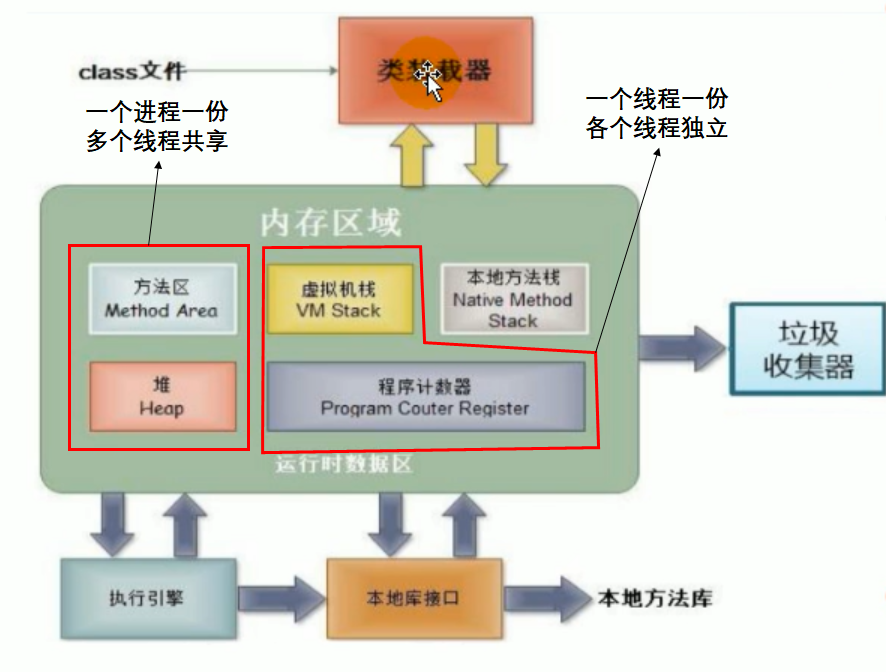
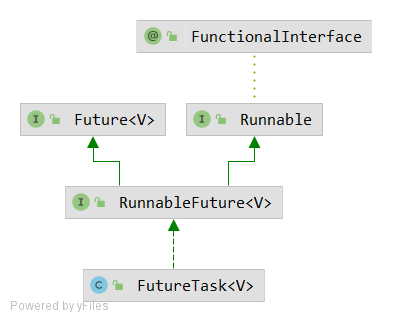
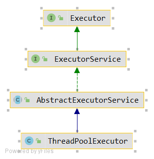
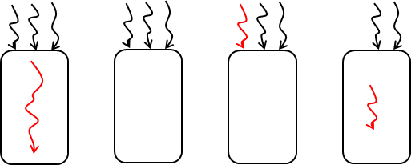
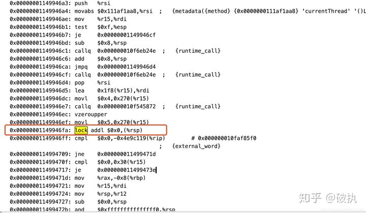
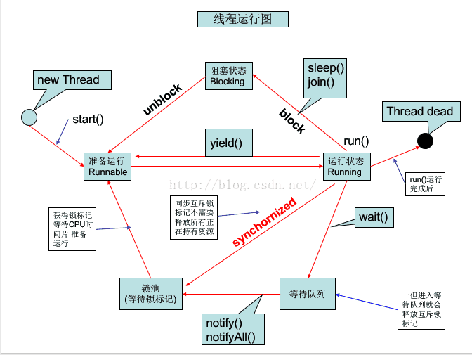
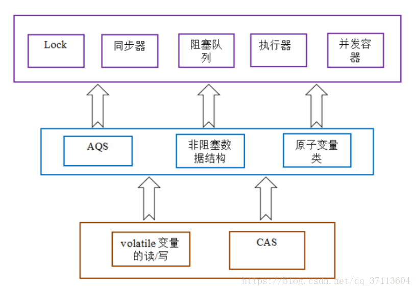

## 1. 基本介绍

#### 1.1 基本概念：程序、进程和线程

程序是为**完成特定任务**、用某种语言编写的**一组指令的集合**，也就是一段静态的代码。

进程是**资源分配**的基本单位，系统在运行时回味每个进程分配不同的内存区域。

线程是任务**调度和执行**的基本单位，每个线程拥有独立的运行栈和程序计数器。



多个线程操作共享的系统资源可能会带来安全隐患。

#### 1.2 并行与并发

并行：**多个CPU**执行多个任务

并发：**一个CPU**（采用时间片）同时执行多个任务


## 2 Java多线程编写

#### 2.1 Java Thread相关API

+   start，启动当前的线程；调用当前线程中的run方法
+   run，重写thread类中的此方法，将创建的线程执行的操作声明在此方法中
+   currentThread静态方法，返回执行当前代码的线程
+   getName 获取当前线程的名字
+   setName 设置当前线程的名字
+   yield 主动释放当前线程的执行权，当然也有可能释放后又抢到了
+   join在线程a中调用线程b的join，此时线程a就进入阻塞状态，指导线程b完全执行之后，线程a才结束阻塞状态。

线程分为：用户线程和守护线程。


#### 2.2 创建Thread方法一

创建thread子类

```java
/**
 * 1. 创建一个thread的子类
 * 2. 重写run方法
 * 3. 创建子类对象
 * 4. 调用start方法
 */
public class ThreadTest {
    public static void main(String[] args) {
        MyThread mt = new MyThread();
        mt.start();

        try {
            Thread.sleep(5);
            System.out.println("hello");
        } catch (InterruptedException e) {
            e.printStackTrace();
        }
    }
}

class MyThread extends Thread {
    @Override
    public void run() {
        for (int i = 0; i < 1000; i++) {
            if (i% 2 == 0) {
                System.out.println(i);
            }
        }
    }
}

```

调用start而不是run，start干了两个操作：

+   启动当前线程
+   调用当前线程的run

利用匿名子类来实现

```java
new Thread() {
    @Override
    public void run() {
        System.out.println("hello");
    }
}.start();
```

#### 2.3 创建Thread方法二

```java
/**
 * 1. 创建一个实现了Runnable接口的类
 * 2. 实现类去实现Runnable中的抽象方法
 * 3. 创建实现类的对象
 * 4. 将此对象作为参数传递到thread类的构造器中
 * 5. 通过thread类的对象调用start
 */

public class RunnableTest {
    public static void main(String[] args) {
        new Thread(new MyRun()).start();
    }
}

class MyRun implements Runnable {
    @Override
    public void run() {
        System.out.println("hello");
        System.out.println("from");
        System.out.println("China");
    }
}
```


#### 2.4 JDK5.0创建线程



实现Callable接口

+   相比于run方法，可以有返回值
+   可以抛出异常
+   支持泛型的返回值
+   需要借用FutureTask，比如获取返回结果，本质上就是继承了Runnable和Future两个接口。

```java
/**
 * 1. 创建一个Callable的子类
 * 2. 实现call方法，将此线程需要执行的操作申明在call中
 * 3. 创建一个子类的对象
 * 4. 创建一个FutureTask对象
 * 5. 构建Thread对象，并初始化
 * 6. Thread启动
 * 7. 获取返回值结果
 */
public class CallTest {
    public static void main(String[] args) {
        FutureTask futureTask = new FutureTask(new MyCall()); // 不利用线程池实现
        new Thread(futureTask).start();
        try {
            Object o = futureTask.get();
            System.out.println((Integer) o);
        } catch (InterruptedException e) {
            e.printStackTrace();
        } catch (ExecutionException e) {
            e.printStackTrace();
        }
    }
}

class MyCall implements Callable {
    @Override
    public Object call() throws Exception {
        int sum = 0;
        for (int i = 0; i < 100; i++) {
            sum += i;
        }
        return sum;
    }
}
```

#### 2.5 使用线程池



+   适用于经常创建和销毁、使用量比较大的资源，比如并发情况下的线程，对性能影响很大。
+   提前创建好多个线程，放入线程池中，使用时直接获取，使用完放回池中，避免频繁创建销毁。
+   好处：
    +   提高响应速度
    +   降低资源消耗
    +   便于线程管理 （corePoolSize、maximumPoolSize、keepAliveTime）

其中ExecutorService是一个接口，下面实际上是一种类型提升，实际上实现的类是：

```java
ThreadPoolExecutor executorService = (ThreadPoolExecutor) Executors.newFixedThreadPool(10);
```

```java
class MyThread implements Callable {
    @Override
    public Object call() throws Exception {
        System.out.println(Thread.currentThread().getName());
        int sum = 0;
        for (int i = 0; i < 100; i++) {
            sum += i;
        }
        return sum;
    }
}

public class ThreadPool {
    public static void main(String[] args) throws ExecutionException, InterruptedException {
        ExecutorService executorService = Executors.newFixedThreadPool(10); // 多态的体现
        MyThread number = new MyThread();

        FutureTask futureTask1 = new FutureTask(number);
        FutureTask futureTask2 = new FutureTask(number);
        executorService.submit(futureTask1);
        executorService.submit(futureTask2);

        Object obj = futureTask1.get();
        System.out.println(obj);

        Object obj2 = futureTask2.get();
        System.out.println(obj2);

        executorService.shutdown();
    }
}
```


#### 2.6 Runnable与Thread创建线程的区别

+   Thread只能单继承，而Runnable可以解决单继承的问题。
+   Runnable更适合处理多个线程有共享数据的情况


#### 2.7 线程的调度

+   时间片：同优先级组成的先进先出d
+   抢占式：高优先级的线程抢占CPU，抢占只意味着高概率被抢占。


#### 2.8 线程池的原理

+   ThreadPoolExecutor的代码

```java
private final BlockingQueue<Runnable> workQueue;              //任务缓存队列，用来存放等待执行的任务
private final ReentrantLock mainLock = new ReentrantLock();   //线程池的主要状态锁，对线程池状态（比如线程池大小
                                                              //、runState等）的改变都要使用这个锁
private final HashSet<Worker> workers = new HashSet<Worker>();  //用来存放工作集
 
private volatile long  keepAliveTime;    //线程存货时间   
private volatile boolean allowCoreThreadTimeOut;   //是否允许为核心线程设置存活时间
private volatile int   corePoolSize;     //核心池的大小（即线程池中的线程数目大于这个参数时，提交的任务会被放进任务缓存队列）
private volatile int   maximumPoolSize;   //线程池最大能容忍的线程数
 
private volatile int   poolSize;       //线程池中当前的线程数
 
private volatile RejectedExecutionHandler handler; //任务拒绝策略
 
private volatile ThreadFactory threadFactory;   //线程工厂，用来创建线程
 
private int largestPoolSize;   //用来记录线程池中曾经出现过的最大线程数
 
private long completedTaskCount;   //用来记录已经执行完毕的任务个数
```

+   提供了三种方法创建线程池

    ```java
    Executors.newCachedThreadPool();        //创建一个缓冲池，缓冲池容量大小为Integer.MAX_VALUE
    Executors.newSingleThreadExecutor();   //创建容量为1的缓冲池
    Executors.newFixedThreadPool(int);    //创建固定容量大小的缓冲池
    ```

    

## 3 线程的声明周期


注意一下这个sleep，在一个同步代码块中，即使调用了sleep，它仍然无法被抢占，直到当前代码块结束，然后再看谁能进入代码块。



#### 五种线程状态

+   新建状态，当一个thread被创建时，处于新建状态
+   就绪状态，处于新建状态的线程被start后，将进入线程队列等待时间片
+   运行状态，当就绪状态的线程获得时间片时，进入运行状态
+   阻塞状态，join操作、sleep操作
+   死亡状态

## 4. 线程的同步

#### 问题的提出

+   线程**安全问题**

+   多个线程的不确定性引起执行结果的不确定
+   多个线程多变量的共享，造成操作的不完整性，破坏数据完整性

#### 同步代码块

```java
synchronized (同步监视器) {
    // 同步的代码
}
// 操作共享数据的代码，就是需要被同步的代码
// 同步监视器 锁
```

任何一个**类的对象**都可以充当锁，要求：要求多个线程必须公用**同一把锁**。

**注意：一个对象只有一把锁。**

#### 同步Synchronized方法

如果操作共享数据的代码完整的声明在一个方法中，我们不妨将此方法声明同步的。

同步方法仍然涉及到同步监视器，只是不需要我么显示的声明。

```java
 synchronized void sell() { // 这种默认的锁是this，在Runnable中用
     
 }

 synchronized static void sell() { // 这种默认的锁是类.class，在继承Thread中用
     
 }
```

#### Synchronized 的原理

使用Synchronized修饰，在对应的代码块前后回加上monitorenter和monitorexit，类似于操作系统中的PV操作。

```java
6: monitorenter
7: aload_2
8: monitorexit
```

#### Volatile的原理

并发编程三大特性：可见性、原子性、有序性

**volatile保证可见性和有序性，但不保证原子性。**

在汇编层面（而不是字节码层面）加入了一个lock指令

lock前缀指令实际上相当于一个内存屏障（也成内存栅栏），内存屏障会提供3个功能：

　　1）它确保指令重排序时不会把其后面的指令排到内存屏障之前的位置，也不会把前面的指令排到内存屏障的后面；即在执行到内存屏障这句指令时，在它前面的操作已经全部完成；

　　2）它会强制将对缓存的修改操作立即写入主存；

　　3）如果是写操作，它会导致其他CPU中对应的缓存行无效。




#### happens-before

**如果一个操作happens-before另一个操作，那么第一个操作的执行结果将对第二个操作可见，而且第一个操作的执行顺序排在第二个操作之前。**

+   **`程序次序规则`**：一个线程内，按照代码顺序，书写在前面的操作先行发生于书写在后面的操作；
+   **`管程锁定规则`：**就是无论是在单线程环境还是多线程环境，对于同一个锁来说，一个线程对这个锁解锁之后，另一个线程获取了这个锁都能看到前一个线程的操作结果！(管程是一种通用的同步原语，synchronized就是管程的实现）；
+   **`volatile变量规则`：**就是如果一个线程先去写一个volatile变量，然后一个线程去读这个变量，那么这个写操作的结果一定对读的这个线程可见。
+   **`线程启动规则`：**在主线程A执行过程中，启动子线程B，那么线程A在启动子线程B之前对共享变量的修改结果对线程B可见。
+   **`线程终止规则`：**在主线程A执行过程中，子线程B终止，那么线程B在终止之前对共享变量的修改结果在线程A中可见。也称线程join()规则
+   **`线程中断规则`**：对线程interrupt()方法的调用先行发生于被中断线程代码检测到中断事件的发生，可以通过Thread.interrupted()检测到是否发生中断。
+   **`传递性规则`：**这个简单的，就是happens-before原则具有传递性，即hb(A, B) ， hb(B, C)，那么hb(A, C)。
+   **`对象终结规则`：**这个也简单的，就是一个对象的初始化的完成，也就是构造函数执行的结束一定 happens-before它的finalize()方法


#### 线程安全的锁机制

```java
 // 同步方法
class Bank {
    private static Bank instance;
    private String name;
    private Bank(String name) {
        this.name = name;
    }

    public synchronized static Bank getInstance() {
        if (instance == null) {
            instance = new Bank("CBC");
        }
        return instance;
    }
}

// 基于双检锁的方式 DCL
class Bank {
    private static Bank instance;
    private String name;
    private Bank(String name) {
        this.name = name;
    }
    public static Bank getInstance() {
        if(instance == null) {
            synchronized (Bank.class) {
                if (instance == null) {
                    instance = new Bank("CBC");
                }
            }
        }
        return instance;
    }
}
```

#### 线程死锁问题

```java
public class DeadLockTest {
    public static void main(String[] args) {
        StringBuffer s1 = new StringBuffer();
        StringBuffer s2 = new StringBuffer();
        new Thread(){
            @Override
            public void run() {
                synchronized (s1) {
                    s1.append("a");
                    s2.append("1");
                    try {
                        sleep(100);
                    } catch (InterruptedException e) {
                        e.printStackTrace();
                    }
                    synchronized (s2) {
                        s1.append("b");
                        s2.append("2");
                        System.out.println(s1);
                        System.out.println(s2);
                    }
                }
            }
        }.start();


        new Thread(new Runnable() {
            @Override
            public void run() {
                synchronized (s2) {
                    s1.append("c");
                    s2.append("3");
                    try {
                        Thread.sleep(100);
                    } catch (InterruptedException e) {
                        e.printStackTrace();
                    }
                    synchronized (s1) {
                        s1.append("d");
                        s2.append("4");

                        System.out.println(s1);
                        System.out.println(s2);
                    }
                }
            }
        }).start();
    }
}
```

#### Lock锁

```java
class MyThread01 extends Thread {
    private static int total_ticket=20;
    private static ReentrantLock lock = new ReentrantLock();

    MyThread01(String name) {
        super(name);
    }

    void  sell_ticket() {
            while (total_ticket > 0) {
                try {
                    lock.lock();
                    if (total_ticket > 0) {
                        System.out.println(Thread.currentThread().getName() + "卖出票:" + total_ticket + ", 当前：" + total_ticket);
                        total_ticket -= 1;
                        try {
                            Thread.sleep(100);
                        } catch (InterruptedException e) {
                            e.printStackTrace();
                        }
                    }
                } finally {
                    lock.unlock();
                }
        }
    }
    @Override
    public void run() {
        sell_ticket();
    }
}
```

+   synchronized与Lock锁的差异
    +   synchronized是Java语言的关键字，因此是内置特性，Lock不是Java语言内置的，Lock是一个接口，通过实现类可以实现同步访问。
    +   synchronized不需要用户手动释放锁，而Lock需要用户去手动释放锁
    +   synchronized是在JVM层面上实现的，不但可以通过一些监控工具监控synchronized的锁定，而且在代码执行时出现异常，JVM会自动释放锁定，但是使用Lock则不行，lock是通过代码实现的，要保证锁定一定会被释放，就必须将unLock()放到finally{}中
+   Synchronized释放锁的操作


+   Synchronized不释放锁的操作

    

+   wait操作的原理

这个线程执行到wait方法时，wait方法会将当前线程放入wait set，使其进行等待直到被唤醒，并放弃lock对象上的所有同步声明，意味着该线程释放了锁，其他线程可以重新执行加锁操作，notify方法会选择wait set中任意一个线程进行唤醒，notifyAll方法会唤醒monitor的wait set中所有线程


## 5. 阻塞队列

非阻塞队列一般提供下面五种方法：

+   add(Element e)
+   remove(Element e)
+   poll() 返回队首元素并删除
+   peek() 只返回队首元素
+   offer(Element e) 类似于，追加元素并返回状态

而阻塞队列额外添加了4个方法

+   put(E e)

+   take()

+   offer(E e,long timeout, TimeUnit unit)

+   poll(long timeout, TimeUnit unit)


## 6 线程的通信

#### 6.1 wait/notify 机制

+   wait()
    +   让当前线程 (Thread.concurrentThread() 方法所返回的线程) 释放对象锁并进入等待（阻塞）状态。
    +   wait操作会释放锁，只能出现在同步代码块中，lock中不行
+   notify()
    +   唤醒一个正在等待相应对象锁的线程，使其进入就绪队列，以便在当前线程释放锁后竞争锁，进而得到CPU的执行。
+   notifyAll()
    +   唤醒所有正在等待相应对象锁的线程，使它们进入就绪队列，以便在当前线程释放锁（代码块执行完成之后）后竞争锁，进而得到CPU的执行。

+   再synchronized内部代码块中需要考虑进行`notify`，因为代码块结束后，对象头（锁）会被释放。但是如果不从`waiting-set`中唤醒的话，其他的线程可能永远不会被唤醒。



#### sleep与wait的异同  [🔗](https://blog.csdn.net/kangkanglou/article/details/82221301)

+   相同点
    +   一旦执行方法都可以使得当前的线程进入阻塞状态
+   不同点
    +   1 申明的位置不同，Thread类中声明sleep，Object类中声明wait
    +   2 调用要求不同，sleep方法可以在任何场景下调用，wait必须在同步代码块中使用
    +   3 sleep不会释放锁，wait会释放锁


**sleep**

-   让当前线程休眠指定时间。
-   休眠时间的准确性依赖于系统时钟和CPU调度机制。
-   不释放已获取的锁资源，如果sleep方法在同步上下文中调用，那么其他线程是无法进入到当前同步块或者同步方法中的。
-   可通过调用interrupt()方法来唤醒休眠线程。

**wait**

-   让当前线程进入等待状态，当别的其他线程调用notify()或者notifyAll()方法时，当前线程进入就绪状态
-   wait方法必须在同步上下文中调用，例如：同步方法块或者同步方法中，这也就意味着如果你想要调用wait方法，前提是必须获取对象上的锁资源
-   当wait方法调用时，当前线程将会释放已获取的对象锁资源，并进入等待队列，其他线程就可以尝试获取对象上的锁资源。


## 7. ThreadLocal

**ThreadLocal使得各线程能够保持各自独立的一个对象，而set方法相当于将创建的副本保存到各自线程的map数据结构种。**

总结：

+   实际的通过ThreadLocal创建的副本是存储在每个线程自己的threadLocals中的；
+   为何threadLocals的类型ThreadLocalMap的键值为ThreadLocal对象，因为每个线程中可有多个threadLocal变量，就像上面代码中的longLocal和stringLocal；
+   在main线程中，没有先set，直接get的话，运行时会报空指针异常。或者重写initialValue方法
+   key是弱引用，object是强引用

```java

public class ThreadLocalTest {
    ThreadLocal<Long> longLocal = new ThreadLocal<Long>();
    ThreadLocal<String> stringLocal = new ThreadLocal<String>();

    public void set() {
        longLocal.set(Thread.currentThread().getId());
        stringLocal.set(Thread.currentThread().getName());
    }

    public long getLong() {
        return longLocal.get();
    }

    public String getString() {
        return stringLocal.get();
    }

    public static void main(String[] args) throws InterruptedException {
        ThreadLocalTest test = new ThreadLocalTest();
        test.set();

        System.out.print(test.getLong() + ", ");
        System.out.println(test.getString());

        Thread thread1 = new Thread(){
            public void run() {
                test.set();
                System.out.print(test.getLong() + ", ");
                System.out.println(test.getString());
            };
        };
        thread1.start();
        thread1.join(); // 阻塞主线程

        System.out.print(test.getLong() + ", ");
        System.out.println(test.getString());
    }
}

```

一个典型例子比如HIbernate中获取会话的代码：

```java
private static final ThreadLocal threadSession = new ThreadLocal();
 
public static Session getSession() throws InfrastructureException {
    Session s = (Session) threadSession.get();
    try {
        if (s == null) {
            s = getSessionFactory().openSession();
            threadSession.set(s);
        }
    } catch (HibernateException ex) {
        throw new InfrastructureException(ex);
    }
    return s;
}
```


## 面试题：三个线程顺序打印ABC

[🔗](https://blog.csdn.net/hefenglian/article/details/82596072)

#### 1. 使用Synchronized加wait和notify

重点，定义一个prev锁和self锁

```java
public class SyncTest {
    public static class ThreadPrinter implements Runnable {
        private String name;
        private Object prev;
        private Object self;

        private ThreadPrinter(String name, Object prev, Object self) {
            this.name = name;
            this.prev = prev;
            this.self = self;
        }

        @Override
        public void run() {
            int count = 3;
            while (count > 0) {// 多线程并发，不能用if，必须使用while循环
                synchronized (prev) { // 先获取 prev 锁
                    synchronized (self) {// 再获取 self 锁
                        System.out.print(name);// 打印
                        count--;
                        self.notifyAll();// 唤醒其他线程竞争self锁，注意此时self锁并未立即释放。
                    }
                    // 此时执行完self的同步块，这时self锁才释放。
                    try {
                        if (count == 0) {
                            // 如果count==0,表示这是最后一次打印操作，通过notifyAll操作释放对象锁。
                            // 最后一次必须全部唤醒，否则所有现场都被挂起，无人唤醒
                            prev.notifyAll();
                        } else {
                            prev.wait(); // 立即释放 prev锁，当前线程休眠，等待唤醒，
                        }
                    } catch (InterruptedException e) {
                        e.printStackTrace();
                    }
                }
            }
        }
    }

    public static void main(String[] args) throws Exception {
        Object a = new Object();
        Object b = new Object();
        Object c = new Object();
        ThreadPrinter pa = new ThreadPrinter("A", c, a);
        ThreadPrinter pb = new ThreadPrinter("B", a, b);
        ThreadPrinter pc = new ThreadPrinter("C", b, c);

        new Thread(pa).start();
        Thread.sleep(10);// 保证初始ABC的启动顺序
        new Thread(pb).start();
        Thread.sleep(10);
        new Thread(pc).start();
        Thread.sleep(10);
    }

}
```

#### 2. 利用lock condition

需要定义一个全局的计算变量count进行递增，如果需要打印10个ABC，那么count最终等于30。

```java
public class LockTest01 {
    public static void main(String[] args) throws InterruptedException {
        Lock lock = new ReentrantLock();
        Condition A = lock.newCondition();
        Condition B = lock.newCondition();
        Condition C = lock.newCondition();

        new Thread(new ThreadPrinter01("A",0,lock,A,B)).start();
        new Thread(new ThreadPrinter01("C",2,lock,C,A)).start();
        new Thread(new ThreadPrinter01("B",1,lock,B,C)).start();
    }

}

class ThreadPrinter01 implements Runnable {
    private static int count = 0; // 类变量
    private String name;
    private int state;
    private Lock lock;
    private Condition next;
    private Condition self;

    ThreadPrinter01(String name,int state,Lock lock, Condition self,Condition next) {
        this.state = state;
        this.name = name;
        this.lock = lock;
        this.next = next;
        this.self = self;
    }

    @Override
    public void run() {
        for (int i = 0; i < 10; i++) {
            lock.lock();
            try {
                while(count % 3 != state)  self.await();
                System.out.println(this.name);
                this.next.signal();
                count += 1;
            } catch (InterruptedException e) {
                e.printStackTrace();
            } finally {
                lock.unlock();
            }
        }
    }
}
```


#### 3. 使用信号量

信号量来自于操作系统种的信号量，一般有两种方法，acquire和release，用于获取资源和释放资源。

```java

/**
 * 信号量可以保证，ABC三者的状态在100-->010-->001-->100之间循环
 */
public class SemaphoreTest {
    public static void main(String[] args) {

        Semaphore A = new Semaphore(1);
        Semaphore B = new Semaphore(0);
        Semaphore C = new Semaphore(0);

        new Thread(new ThreadPrinter02("A",A,B)).start();
        new Thread(new ThreadPrinter02("B",B,C)).start();
        new Thread(new ThreadPrinter02("C",C,A)).start();
    }
}

class ThreadPrinter02 implements Runnable {
    private String name;
    private Semaphore self;
    private Semaphore next;

    ThreadPrinter02(String name,Semaphore self, Semaphore next) {
        this.name = name;
        this.self = self;
        this.next = next;
    }

    @Override
    public void run() {
        int count = 10;
        for (int i = 0; i < count; i++) {
            try {
                this.self.acquire(); // 当前减一
                System.out.println(this.name);
                this.next.release(); // 下一个加一
            } catch (InterruptedException e) {
                e.printStackTrace();
            }
        }

    }
}
```


#### 4. 使用volatile关键字，实现多个线程的通信

```java
public class VolatileTest {
    public static void main(String[] args) {
        new Thread(new TheadPrinter()).start();
        new Thread(new TheadPrinter()).start();
        new Thread(new TheadPrinter()).start();
    }
}

class TheadPrinter implements Runnable {
    private static final String []data = {"A","B","C"};
    private volatile static int state = 0;

    @Override
    public void run() {
        for (int i = 0; i < 10; i++) {
            synchronized (ThreadPrinter.class) {
                System.out.println(state + " ~ " + data[state % 3]);
                state += 1;
            }
        }
    }
}

// 或者

public class VolatileTest {
    public static void main(String[] args) {
        new Thread(new ThreadPrinter03(0)).start();
        new Thread(new ThreadPrinter03(1)).start();
        new Thread(new ThreadPrinter03(2)).start();
    }
}

class ThreadPrinter03 implements Runnable {
    private static volatile int state = 0;
    private String [] names = {"A","B","C"};
    private int type;
    ThreadPrinter03(int type) {
        this.type = type;
    }

    @Override
    public void run() {
        for (int i = 0; i < 10; ) {
            if(state % 3 == type) {
                System.out.println(names[type]);
                state += 1;
                i += 1;
            }
        }
    }
}
```

单例模式的线程安全方式创建 


#### 什么是ThreadLocal变量？

　　ThreadLocal是Java里一种特殊的变量。每个线程都有一个ThreadLocal就是每个线程都拥有了自己独立的一个变量，竞争条件被彻底消除了。它是为创建代价高昂的对象获取线程安全的好方法，比如你可以用ThreadLocal让SimpleDateFormat变成线程安全的，因为那个类创建代价高昂且每次调用都需要创建不同的实例所以不值得在局部范围使用它，如果为每个线程提供一个自己独有的变量拷贝，将大大提高效率。首先，通过复用减少了代价高昂的对象的创建个数。其次，你在没有使用高代价的同步或者不变性的情况下获得了线程安全。


#### 自旋锁  Compare And Set ~ CAS

自旋锁本质上就是`while`或者`do-while`。

-   尝试获取锁的线程不会立即阻塞，而是采用循环的方法尝试获取锁

-   这样的好处是减少线程上下文切换的消耗，缺点是循环会消耗CPU

    

#### 抽象的队列式同步器 Abstract Queued Synchronizer ~ AQS

[🔗](https://www.cnblogs.com/waterystone/p/4920797.html)


AQS维护一个volatile变量（代表共享资源）和一个FIFO线程等待队列（多线程争用资源被阻塞时会进入此队列）

不同的自定义同步器争用共享资源的方式也不同。**自定义同步器在实现时只需要实现共享资源state的获取与释放方式即可**，至于具体线程等待队列的维护（如获取资源失败入队/唤醒出队等），AQS已经在顶层实现好了。自定义同步器实现时主要实现以下几种方法：

-   isHeldExclusively()：该线程是否正在独占资源。只有用到condition才需要去实现它。
-   tryAcquire(int)：独占方式。尝试获取资源，成功则返回true，失败则返回false。
-   tryRelease(int)：独占方式。尝试释放资源，成功则返回true，失败则返回false。
-   tryAcquireShared(int)：共享方式。尝试获取资源。负数表示失败；0表示成功，但没有剩余可用资源；正数表示成功，且有剩余资源。
-   tryReleaseShared(int)：共享方式。尝试释放资源，如果释放后允许唤醒后续等待结点返回true，否则返回false。




+   acquire流程

    乐观锁主要就是两个步骤：冲突检测和数据更新。


